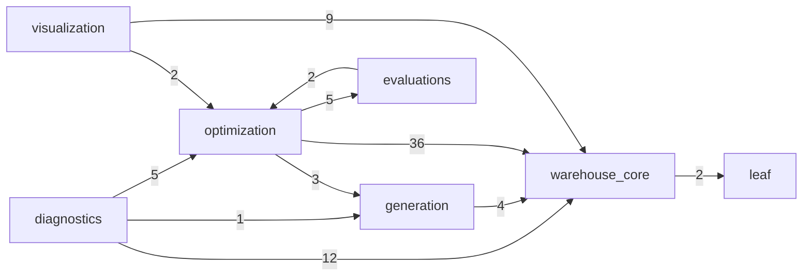
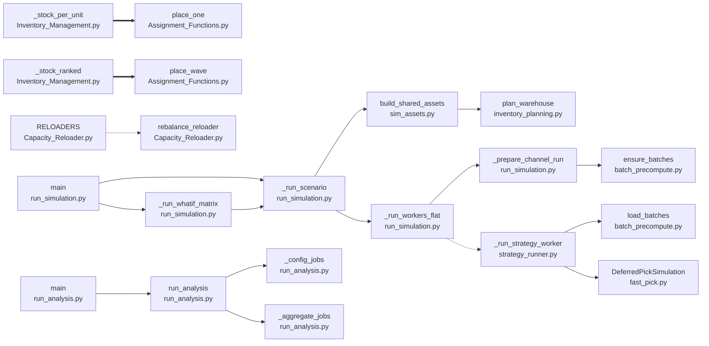

<!-- GENERATED by context/arch/render.py — do not edit by hand. -->
# Architecture — call/import graph

Derived from `context/arch/graph.json` (built from source by `extract.py`).

## Layer import overview

Cross-layer module imports (edge label = number of import statements).

## Backbone call structure

The curated caller-to-callee edges from `context/architecture.yml` (solid = calls, dotted = ref, thick = dispatch).

