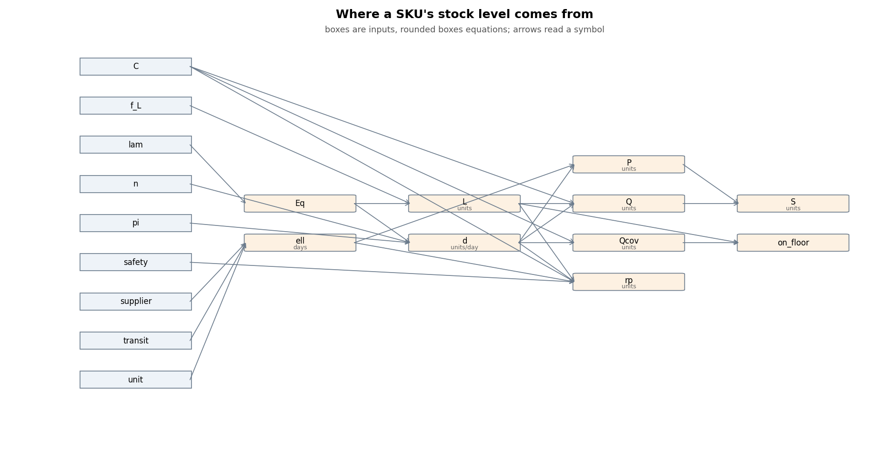
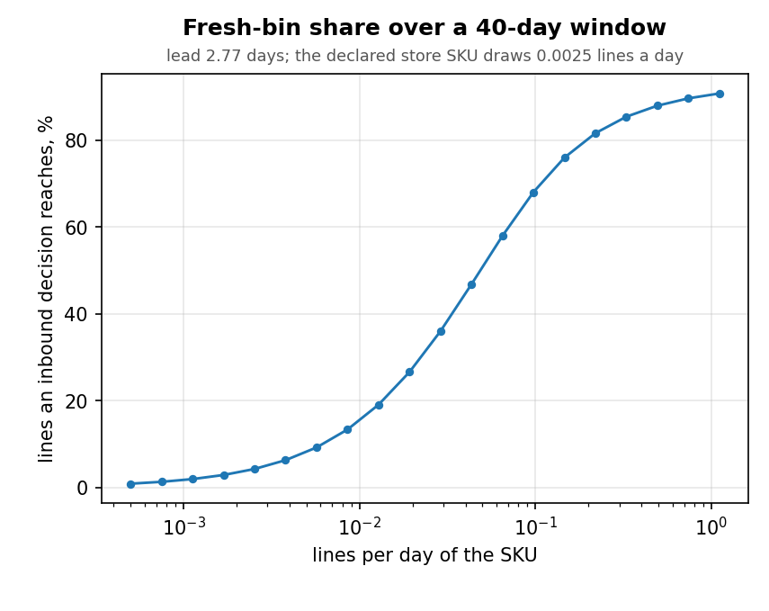

# Closed-form models

Closed forms for what the simulator charges and why: where a SKU's stock level comes from,
when it reorders, what one pick costs, how much of the picking an inbound decision can reach,
and how long a placement rule keeps finding good bins.  **This page is generated** from
`Warehouse/kernel/closed_form.py` and `Optimization/simconfig/models/` -- each equation below
is printed from the same expression tree that computes it, and the equations marked
_mirrors_ are held equal to the simulator code they name by `Tests/unit/test_closed_form.py`.
The worked numbers are the reference 40k catalogue's store section at the declared demand;
the study that verified each law against the simulator is `.scratch/aisle-churn/` (S00-S13).

## What one pick costs (store)

One bin visit for one SKU: the intercept once per line, the per-item charge and the handling term once per unit, all scaled by the height bracket.  The cart-swap penalty is a separate timed step.

**Inputs**

- $I = 15$
- $c_v = 0.7$
- $c_w = 0.58$
- $p = 0.5$
- $q = 3$
- $\mathrm{vol}_s = 1.5$
- $w_s = 20$
- $y_b = 114$

**M** — the height bracket that scales every at-location term _(mirrors `Warehouse.kernel.cost_model:height_multiplier`)_

$$ M(y) = \begin{cases} 1 & \text{if } y_b < 96 \\ 1.2 & \text{if } y_b < 240 \\ 1.4 & \text{otherwise} \end{cases} = \begin{cases} 1 & \text{if } 114 < 96 \\ 1.2 & \text{if } 114 < 240 \\ 1.4 & \text{otherwise} \end{cases} = 1.2 $$

**v** — per-unit handling of weight (pow:1.5) and volume (log:2) _(mirrors `Warehouse.kernel.cost_model:handle_var`)_

$$ v_s = c_w\,\max\left(w_s, 0\right)^{1.5} + c_v\,\frac{\ln\left(\max\left(\mathrm{vol}_s, 1\right)\right)}{\ln\left(2\right)} = 0.58\,\max\left(20, 0\right)^{1.5} + 0.7\,\frac{\ln\left(\max\left(1.5, 1\right)\right)}{\ln\left(2\right)} = 52.29 $$

**at_location** (s) — the at-location labour of one visit: one intercept per line, a per-unit charge and a per-unit handling term, all scaled by the height bracket _(mirrors `Warehouse.kernel.cost_model:per_pick`)_

$$ c_{\mathrm{loc}} = M(y)\,\left(I + q\,p + q\,v_s\right) = 1.2\,\left(15 + 3 \cdot 0.5 + 3 \cdot 52.29\right) = 208\ \mathrm{s} $$

## Where a SKU's stock level comes from

Where one SKU's equilibrium units come from: the declaration `Optimization/simconfig/coverage.py` stamps on it.

**Inputs**

- $C = 10$
- $f = 1.308$
- $\lambda_s = 10$
- $n = 58.59$
- $\pi_s = 4.188 \times 10^{-5}$
- $\sigma_{\mathrm{safe}} = 2$
- $\ell_{\mathrm{sup}} = 0$
- $\mathbb{E}\lceil T/D \rceil = 1.766$
- $u_d = 1$

**Eq** — units per line: q = max(1, X), X ~ Poisson(lambda) _(mirrors `Optimization.simconfig.models.levels:mirror_line_mean`)_

$$ \mathbb{E}[q_s] = \lambda_s + e^{-\lambda_s} = 10 + e^{-10} = 10 $$

**d** (units/day) — daily units at the declared line rate and the line share

$$ d_s = n\,\pi_s\,\mathbb{E}[q_s] = 58.59 \cdot 4.188 \times 10^{-5} \cdot 10 = 0.02453\ \mathrm{units/day} $$

**L** (units) — the line floor: the least stock a SKU holds, f lines of its mean line

$$ L_s = \max\left(1, \left\lceil f\,\mathbb{E}[q_s] - \epsilon \right\rceil\right) = \max\left(1, \left\lceil 1.308 \cdot 10 - \epsilon \right\rceil\right) = 14\ \mathrm{units} $$

**ell** (days) — order-to-shelf lead: supplier lead (batches x days per batch) plus the transit law _(mirrors `Optimization.simconfig.models.levels:mirror_lead`)_

$$ \ell_s = \max\left(0, \ell_{\mathrm{sup}}\right)\,u_d + \max\left(0, \mathbb{E}\lceil T/D \rceil\right) = \max\left(0, 0\right)\,1 + \max\left(0, 1.766\right) = 1.766\ \mathrm{days} $$

**P** (units) — the pipeline allowance: units expected in transit over the lead

$$ P_s = \max\left(0, \operatorname{round}\left(d_s\,\max\left(0, \ell_s\right)\right)\right) = \max\left(0, \operatorname{round}\left(0.02453\,\max\left(0, 1.766\right)\right)\right) = 0\ \mathrm{units} $$

**Qcov** (units) — the coverage term: C days of demand

$$ Q^{\mathrm{cov}}_s = \operatorname{round}\left(C\,d_s\right) = \operatorname{round}\left(10 \cdot 0.02453\right) = 0\ \mathrm{units} $$

**Q** (units) — the order-up-to: coverage days of demand, floored at the line floor _(mirrors `Optimization.simconfig.models.levels:mirror_Q`)_

$$ Q_s = \begin{cases} 1 & \text{if } \max\left(L_s, \operatorname{round}\left(C\,d_s\right)\right) \le 1 \\ \max\left(L_s, \operatorname{round}\left(C\,d_s\right)\right) & \text{otherwise} \end{cases} = \begin{cases} 1 & \text{if } \max\left(14, \operatorname{round}\left(10 \cdot 0.02453\right)\right) \le 1 \\ \max\left(14, \operatorname{round}\left(10 \cdot 0.02453\right)\right) & \text{otherwise} \end{cases} = 14\ \mathrm{units} $$

**rp** (units) — the reorder point: lead-plus-safety demand, floored at L, one below Q _(mirrors `Optimization.simconfig.models.levels:mirror_rp`)_

$$ r_s = \begin{cases} 1 & \text{if } \max\left(L_s, \operatorname{round}\left(C\,d_s\right)\right) \le 1 \\ \min\left(\max\left(L_s, \operatorname{round}\left(C\,d_s\right)\right) - 1, \max\left(L_s, \operatorname{round}\left(d_s\,\left(\max\left(0, \ell_s\right) + \sigma_{\mathrm{safe}}\right)\right)\right)\right) & \text{otherwise} \end{cases} = \begin{cases} 1 & \text{if } \max\left(14, \operatorname{round}\left(10 \cdot 0.02453\right)\right) \le 1 \\ \min\left(\max\left(14, \operatorname{round}\left(10 \cdot 0.02453\right)\right) - 1, \max\left(14, \operatorname{round}\left(0.02453\,\left(\max\left(0, 1.766\right) + 2\right)\right)\right)\right) & \text{otherwise} \end{cases} = 13\ \mathrm{units} $$

**on_floor** — 1 when the coverage term does not exceed the floor: base stock, Q = L

$$ \mathbb{1}_{\mathrm{floor}} = \begin{cases} 1 & \text{if } Q^{\mathrm{cov}}_s \le L_s \\ 0 & \text{otherwise} \end{cases} = \begin{cases} 1 & \text{if } 0 \le 14 \\ 0 & \text{otherwise} \end{cases} = 1 $$

**S** (units) — the inventory position a fired order restores: order-up-to plus pipeline

$$ S_s = Q_s + P_s = 14 + 0 = 14\ \mathrm{units} $$

## When it reorders

When a floor SKU reorders: after the running quantity taken since its last fire reaches P + 1, for exactly what was taken.

**Inputs**

- $P_s = 0$
- $\kappa_s = 0$
- $\lambda_s = 10$
- $p_s = 0.002453$

**Eq** — units per line, q = max(1, Poisson)

$$ \mathbb{E}[q_s] = \lambda_s + e^{-\lambda_s} = 10 + e^{-10} = 10 $$

**N** (lines) — lines per fire: the renewal count of the running quantity over P + 1 + epsilon, epsilon the supply noise the last fire landed with (1 when P = 0 and there is no noise -- every line fires)

$$ \mathbb{E}[N_s] = \mathbb{E}_{\epsilon}\,\operatorname{U}_{\Sigma}\left(\lambda_s, P_s, \kappa_s\right) = \mathbb{E}_{\epsilon}\,\operatorname{U}_{\Sigma}\left(10, 0, 0\right) = 1\ \mathrm{lines} $$

**lot** (units) — units per fire, by Wald

$$ \mathbb{E}[\mathrm{lot}_s] = \mathbb{E}[q_s]\,\mathbb{E}[N_s] = 10 \cdot 1 = 10\ \mathrm{units} $$

**fires** (fires/day) — reorders fired per day at the realised line rate

$$ \phi_s = \frac{p_s}{\mathbb{E}[N_s]} = \frac{0.002453}{1} = 0.002453\ \mathrm{fires/day} $$

**ordered** (units/day) — units ordered per day: every unit taken is ordered back

$$ o_s = p_s\,\mathbb{E}[q_s] = 0.002453 \cdot 10 = 0.02453\ \mathrm{units/day} $$

## How much picking an inbound decision reaches

The fresh-bin law: an inbound decision reaches only lines that follow an earlier line of the same SKU by at least the order-to-shelf lead.

**Inputs**

- $H = 40$
- $\ell = 2.766$
- $\lambda_s = 0.002453$

**x** (lines) — expected lines of the SKU after the first lead of the window

$$ x_s = \lambda_s\,\max\left(0, H - \ell\right) = 0.002453\,\max\left(0, 40 - 2.766\right) = 0.09135\ \mathrm{lines} $$

**served** (lines) — lines served from a bin a reorder filled inside the window

$$ \mathbb{E}[\mathrm{served}_s] = x_s - \left(1 - e^{-x_s}\right) = 0.09135 - \left(1 - e^{-0.09135}\right) = 0.004048\ \mathrm{lines} $$

**phi** — the SKU's share of its lines an inbound decision can reach

$$ \varphi_s = \frac{\mathbb{E}[\mathrm{served}_s]}{\lambda_s\,H} = \frac{0.004048}{0.002453 \cdot 40} = 0.04125 $$

## How long a ranked rule keeps finding good bins

Where a ranked rule settles once its good free bins are spent.

**Inputs**

- $G_{\mathrm{free}} = 36{,}766$
- $m = 1{,}774$
- $n_b = 248{,}350$
- $\nu_b = 1$
- $s = 0.641$
- $\sigma_G = 0.243$
- $\sum_{b\'} n_{b\'}\nu_{b\'} = 1{,}020{,}434$

**s_star** — the long-run bracket share of a velocity-blind ranked rule: a bracket hands out what it frees

$$ s^*_b = \frac{n_b\,\nu_b}{\sum_{b\'} n_{b\'}\nu_{b\'}} = \frac{248{,}350 \cdot 1}{1{,}020{,}434} = 0.2434 $$

**B** (days) — breathing room: days until the good free pool is spent at the net rate placed-good minus freed-good

$$ B = \frac{G_{\mathrm{free}}}{m\,\left(s - \sigma_G\right)} = \frac{36{,}766}{1{,}774\,\left(0.641 - 0.243\right)} = 52.07\ \mathrm{days} $$

## What the placement rule is worth on the picks

The height mechanism of a ranked rule's pick gap (S09 section 3).

**Inputs**

- $\bar M_{\mathrm{free}} = 1.263$
- $\bar M_{\mathrm{rank}} = 1.162$
- $T = 26{,}845{,}232$
- $U = 258{,}930$
- $\bar h = 59$
- $\varphi = 0.086$

**gap** — the placement rule's pick gap, earned on the picks fresh bins serve: U the window's picked units, h the mean handling per unit at M = 1

$$ \Delta T / T = \frac{\varphi\,U\,\bar h\,\left(\bar M_{\mathrm{rank}} - \bar M_{\mathrm{free}}\right)}{T} = \frac{0.086 \cdot 258{,}930 \cdot 59\,\left(1.162 - 1.263\right)}{26{,}845{,}232} = -0.004943 $$

## The fresh-bin share over demand density

A SKU drawn once in a window has no line an inbound decision could serve; the share climbs
with the line rate because a later line of the same SKU drains the fresh packs first
(smallest on hand, ADR-0003).  Demand density is therefore the lever that lets an inbound
decision reach the picking: 8% of the store's picks at the declared demand, ~70% at 30x.
