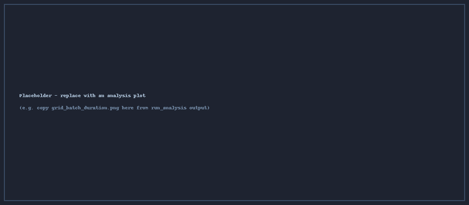

# Example run (2026-06)

> Template page. Copy it to `docs/results/<your-run>.md`, replace the text and images, then
> add it to `nav:` in `mkdocs.yml`. Delete this quote block when you do.

## Run parameters

| Parameter | Value |
|-----------|-------|
| SKUs | 20,000 |
| Warehouse fill | 90% |
| Batches | 100 |
| Pickers | 25 |
| Strategies | FIFO, TripMin, TripMax, MaxClu, MinClu |
| Seed (world / batches) | 42 / 1337 |

## Summary

Write the takeaway here in a sentence or two — e.g. which strategy won on batch duration,
by how much, and any surprises. Use **bold** for headline numbers and call-outs for caveats:

!!! note
    TripMin reduced mean batch duration by **X%** vs. FIFO; MaxClu improved co-location
    (Σ lift) but slightly increased churn.

## Headline metrics

| Strategy | Mean batch duration | vs. FIFO | Σ f·D | Churn (%/batch) |
|----------|--------------------:|---------:|------:|----------------:|
| FIFO     | – | — | – | – |
| TripMin  | – | – | – | – |
| TripMax  | – | – | – | – |
| MaxClu   | – | – | – | – |
| MinClu   | – | – | – | – |

## Plots

<figure markdown>
  { width=820 }
  <figcaption>Replace with <code>grid_batch_duration.png</code> from the run's analysis output.</figcaption>
</figure>

<figure markdown>
  { width=820 }
  <figcaption>Replace with <code>compare/breakdown/pick_vs_travel.png</code>.</figcaption>
</figure>

## Discussion

Longer commentary, interpretation, and next steps go here.
