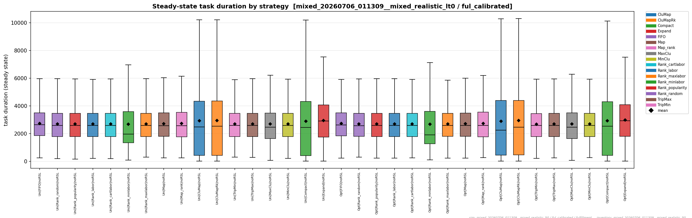
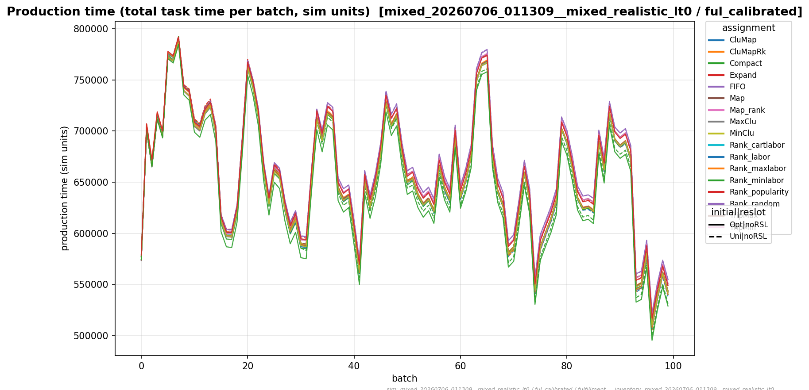
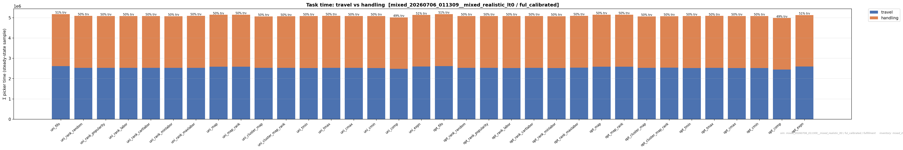
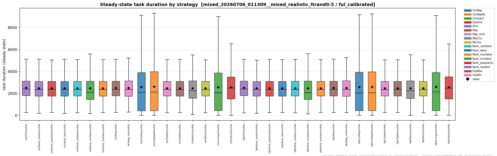
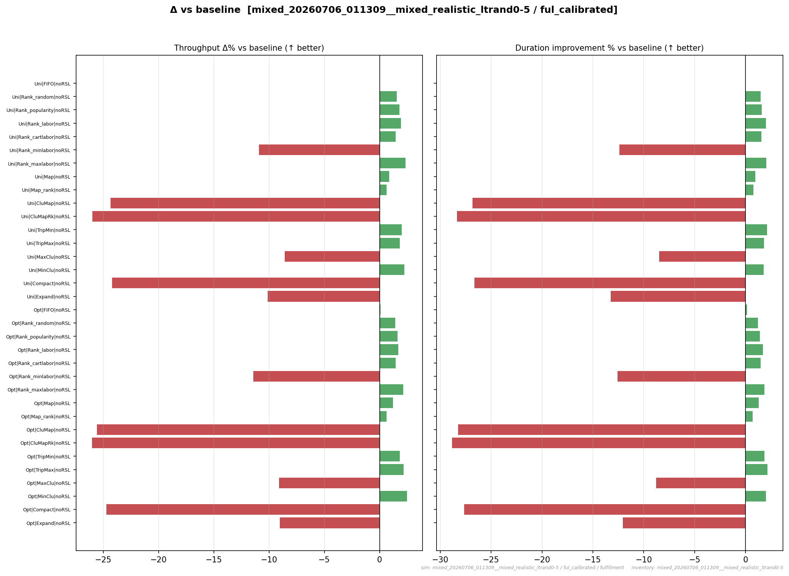
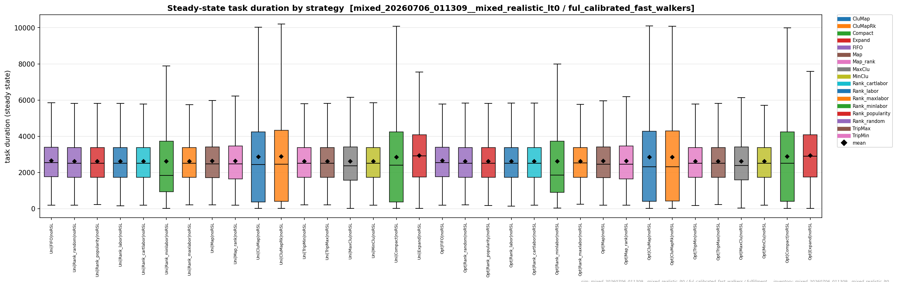
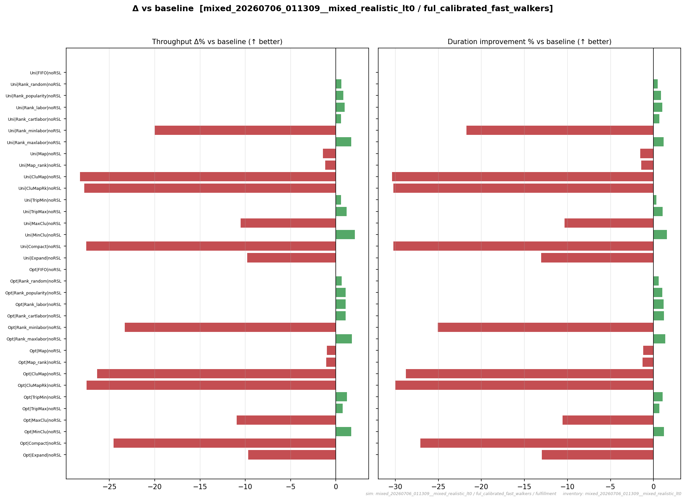
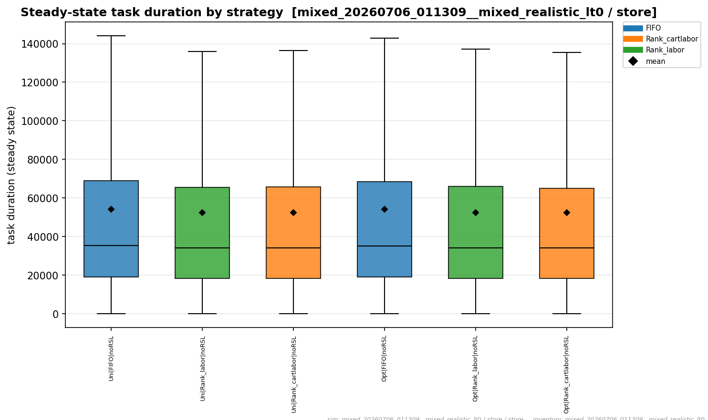
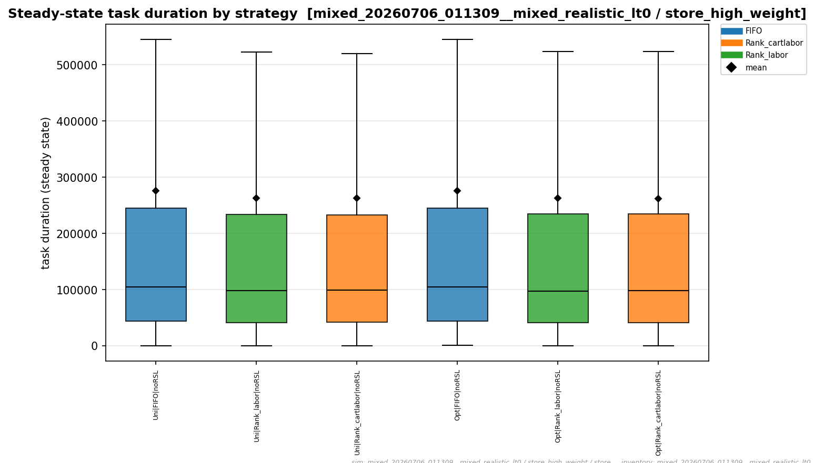
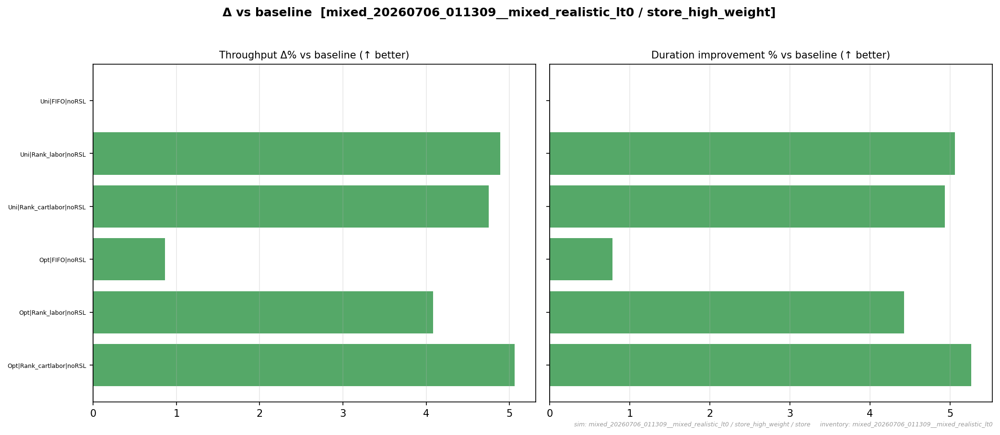

# Everything else

The [Highlights](highlights.md) stay focused on each channel's winner. This page is the whole
field: **every** assignment function, not just the top performers — the full-suite ranking, the
per-batch overlays, and the bracket controls that are *designed to lose*. Because the store
channel only sweeps its labor subset, the full 17-family competition lives on the **fulfillment**
channel; the store subset is shown at the end.

!!! note "Notes"
    The reason the full field is worth a page of its own: **the winners' margins are only
    interpretable against the losers' spread.** A −3.4 % champion means one thing when the suite
    spans −3.4 % to −3.0 %, and something entirely different when it spans −3.4 % to +20 %. This
    page is where that scale is visible.

    Note also why the 17-family competition runs on the **fulfillment** channel: the store channel
    sweeps only its labour subset (`CHANNEL_RESTOCKS` in `Optimization/config/strategies.py`), so
    the store arms shown at the end are a deliberate subset rather than a truncated run.

## The headline: most families don't beat FIFO

Across the fulfillment suite, only a handful of families beat the FIFO (first-in-first-out)
baseline on total task time by a meaningful margin — **`Compact`** and the **cluster-map** family
lead (≈ −2 to −3.4%), and the ranked-labor families land small gains. Everything else clusters
near FIFO or lands *worse*:

- The **bracket controls are designed to lose** — `tmax` (travel), `cmin` (affinity), `expn`
  (co-demand), and `rank_maxlabor` deliberately place badly to bound each lever, and they read
  clearly worse than FIFO.
- Several genuine "optimizations" still fail on *total* task time or trade one metric for another:
  a placement that shortens sweeps can serialise the work (Compact's makespan/throughput
  [trade-off](highlights.md#the-compact-trade-off)); one pointed at the wrong objective makes total
  task time **worse**, not better.

Read the box plots as *steady-state task duration per arm* (lower = better; the FIFO arms are the
reference) and the overlays as *production time per batch* (Opt = solid, Uni = dashed).

## Fulfillment channel — full 17-family suite

Both initial layouts (`uni`, `opt`) × 17 restock families = **34 arms**, at base calibration and
lead time `lt0`. The ranking holds under randomised lead time (`ltrand0-5`) and fast walkers — see
the collapsibles.

<figure markdown>
  { width=900 }
  <figcaption>Steady-state task duration for every fulfillment arm (Uni|… and Opt|… × 17
  families); diamond = mean. The full suite, ranked.</figcaption>
</figure>

<figure markdown>
  { width=900 }
  <figcaption>Production time per batch, all 17 assignment functions overlaid (Opt = solid,
  Uni = dashed).</figcaption>
</figure>

<figure markdown>
  { width=900 }
  <figcaption>Per-function throughput Δ% (left) and duration-improvement % (right) vs FIFO for all
  34 arms. Green = better, red = worse.</figcaption>
</figure>

<figure markdown>
  { width=900 }
  <figcaption>Task-time composition (handling / travel / cart) per strategy — where each family
  spends its labor.</figcaption>
</figure>

??? note "Fulfillment · base calibration · ltrand0-5 (randomised lead time)"
    { width=900 }

    *Steady-state task duration, fulfillment, ltrand0-5 — same shape as `lt0`.*

    { width=900 }

    *Per-function deltas vs FIFO, ltrand0-5.*

??? note "Fulfillment · fast walkers (ful_calibrated_fast_walkers) · lt0"
    { width=900 }

    *Faster cross-aisle travel compresses the spread — placement matters less when walking is
    cheap, so the winners' margins shrink (Compact ≈ −1.6%).*

    { width=900 }

    *Per-function deltas vs FIFO, fast walkers.*

## Store channel — labor subset

The store channel sweeps only the families it would deploy — `FIFO`, `Rank_labor`,
`Rank_cartlabor` (`STORE_RESTOCKS`) — so its competition is a **6-arm** subset, not the full
suite. `Rank_labor` and `Rank_cartlabor` are indistinguishable here (the large `StoreCart` makes
the cart term inert).

<figure markdown>
  { width=820 }
  <figcaption>Store channel (base calibration, <code>lt0</code>): steady-state task duration for
  the 6 store arms; diamond = mean.</figcaption>
</figure>

??? note "Store · weight penalty ↑ (store_high_weight) · lt0"
    { width=820 }

    *With the steeper $w^{2}$ weight penalty, the labor families' headroom grows (≈ −4.8% vs FIFO):
    when heavy items are more expensive to pick, placing them well is worth more.*

    { width=820 }

    *Per-function deltas vs FIFO, store_high_weight.*

## Discussion

Interpretation, cross-channel comparison, and next steps go here. The winning strategies and their
mathematics are on the [Highlights](highlights.md); the full family catalogue is on the
[Formula reference](formula-reference.md).

!!! note "Notes"
    The finding that generalised furthest from this page is the negative one: **an optimisation
    aimed at the wrong proxy makes total task time worse, not merely flat.** Several genuine
    cohesion- and co-demand-only families land on the wrong side of FIFO — not because they fail
    to optimise, but because they optimise something that is not the objective.

    That is why every later experiment reports its baseline explicitly and keeps the adversarial
    arms in the suite. A result that only shows the winners cannot distinguish "this lever is
    worth 3 %" from "this lever is worth 3 % and costs 20 % when pointed the wrong way".
