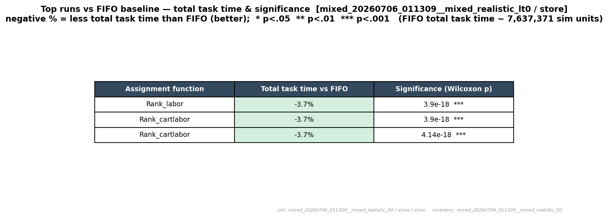
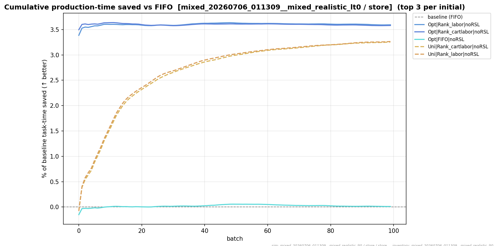
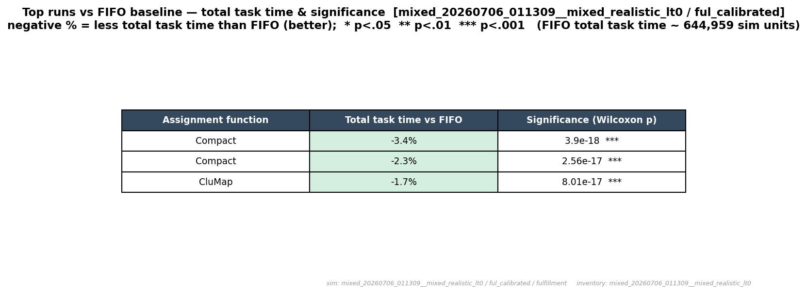
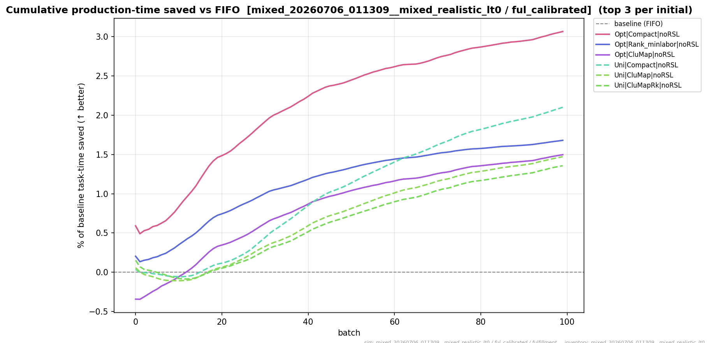
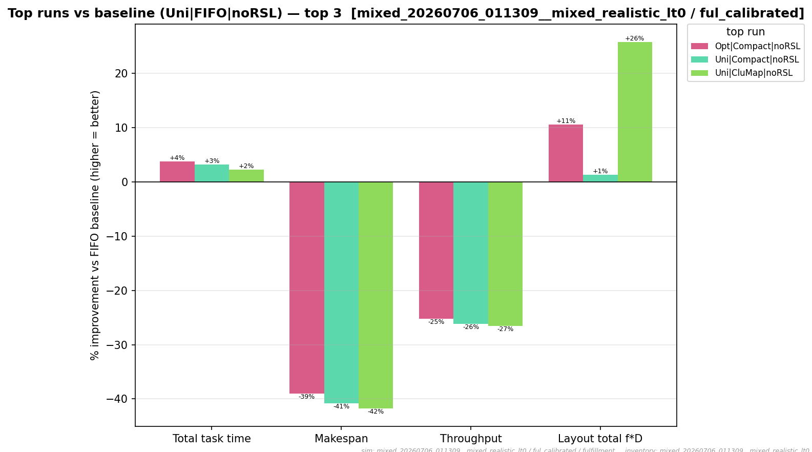
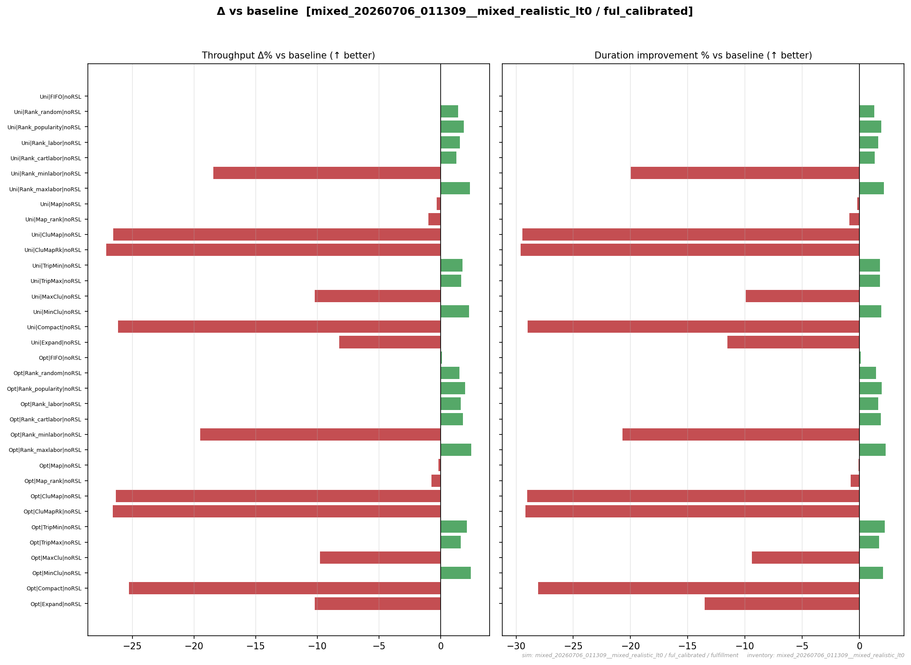

# Highlights

The headline findings of Experiment 2: the **best warehouse for stores** and the **best warehouse
for fulfillment**, the winning assignment functions shown in mathematics, the productivity-change
graphs by assignment function, and the percent-versus-FIFO tables. The whole strategy suite —
including the families that *lose* — is on [Everything else](everything-else.md).

!!! abstract "Summary"
    Two independent warehouses produced **two different champions**, both measured against the
    `uni_fifo_norsl` (FIFO) baseline on total task time (lower = better):

    - **Store warehouse → `Rank_labor`**, ≈ **−3.7%** total task time (base calibration), with
      `Rank_cartlabor` tied to the decimal — the large `StoreCart` makes the cart term inert.
    - **Fulfillment warehouse → `Compact`**, ≈ **−3.4%** total task time at base calibration
      (≈ **−1.6%** with fast walkers). Compact minimises total picking labor by shortening
      aisle sweeps, but **trades away makespan and instantaneous throughput** — see the
      [trade-off](#the-compact-trade-off).

    The ranking holds across both lead-time variants (`lt0`, `ltrand0-5`).

---

## Best warehouse for stores → Rank_labor

!!! success "Store champion — `Rank_labor` (opt initial layout)"
    On the store channel (`StoreCart`, 25 pickers), travel-aware labor balancing cut total task
    time by **≈ −3.7%** versus FIFO — the strongest, and the only meaningful, mover in the store
    subset. `Rank_cartlabor` matches it to the decimal because the store cart is large enough that
    its cart-swap term is ≈ 0.

**The winning mathematics.** `Rank_labor` is a travel-aware **LPT (longest-processing-time) labor
balance**. Each bin carries a per-pick **labor primitive** — height-scaled handling plus
entrance-relative travel:

$$\ell(b) \;=\; M(y_b)\,(t_0 + h) + D_b,\qquad
D_b \;=\; x_{\text{pace}}\,x_{\text{phys}} + y_{\text{pace}}\,y_{\text{phys}}.$$

Each aisle $a$ accumulates its total expected labor $L_a = \sum_{s\in a} f_s\,q_s\,\ell(b_s)$, and
each arriving unit — **costliest SKU first** — is placed in the aisle–bin pair that least raises
the busiest aisle:

$$\boxed{\;\arg\min_{(a,\,b)}\ \bigl(L_a + f_s\,q_s\,\ell(b)\bigr)\;}$$

Here $f_s$ is the SKU's relative pick frequency (a $[0,1]$ share) and $q_s$ its pick quantity. The
cart-aware sibling `Rank_cartlabor` adds an expected cart-swap term to $L_a$ (see the
[Formula reference](formula-reference.md#rank-cartlabor)); for the big store cart that term
vanishes, so the two tie.

**The percents (no trend).** Total task time versus FIFO and its significance, for the store
channel — the top runs, ranked:

<figure markdown>
  { width=820 }
  <figcaption>Store channel (<code>lt0</code>, base calibration): <code>Rank_labor</code> and
  <code>Rank_cartlabor</code> both ≈ −3.7% vs FIFO, all at <em>p</em> &lt; .001 (Wilcoxon).</figcaption>
</figure>

**Productivity change over the run.** Cumulative production-time improvement versus FIFO, batch by
batch — the store winners pull ahead and stay ahead:

<figure markdown>
  { width=820 }
  <figcaption>Store channel: cumulative production-time improvement vs FIFO for the top-3 store
  arms. Higher = more labor saved.</figcaption>
</figure>

!!! note "Store — reading of the result"
    Space intentionally left blank for user input

---

## Best warehouse for fulfillment → Compact

!!! success "Fulfillment champion — `Compact` (opt initial layout)"
    On the fulfillment channel (`FulfillmentCart`, 20 pickers, full 17-family suite), **Compact**
    — placing each SKU nearest its co-demand partners' column centroid — won on total task time
    by **≈ −3.4%** (base calibration) and **≈ −1.6%** with fast walkers. What was a bracket
    *control* in Experiment 1 is the fulfillment channel's best strategy here.

**The winning mathematics.** `Compact` minimises within-aisle **span**. For a SKU $s$ entering an
aisle, let $c_x$ be the demand-weighted column centroid of its co-demanded partners already there:

$$c_x \;=\; \frac{\sum_p \bigl(\text{lift}(s,p)-1\bigr)\,f_p\,x_p}
{\sum_p \bigl(\text{lift}(s,p)-1\bigr)\,f_p}.$$

The unit is placed in the column **nearest** that centroid, shortening the picker's sweep path:

$$\boxed{\;\arg\min_{b}\ \lvert x_b - c_x \rvert\;}$$

where $x_b$ is a bin's column position and $\text{lift}(s,p)$ the co-occurrence strength of SKUs
$s$ and $p$. Concentrating co-picked stock into a tight column is what pays off under the small
fulfillment cart.

**The percents (no trend).** Total task time versus FIFO and its significance, fulfillment
channel:

<figure markdown>
  { width=820 }
  <figcaption>Fulfillment channel (<code>lt0</code>, base calibration): <code>Compact</code>
  ≈ −3.4% vs FIFO (Opt and Uni both land top-3), <code>CluMap</code> ≈ −1.7%, all
  <em>p</em> &lt; .001.</figcaption>
</figure>

**Productivity change over the run:**

<figure markdown>
  { width=820 }
  <figcaption>Fulfillment channel: cumulative production-time improvement vs FIFO for the top-3
  arms.</figcaption>
</figure>

### The Compact trade-off { #the-compact-trade-off }

Compact wins on **total picking labor**, but concentrating stock into tight columns serialises the
work — it **raises makespan and lowers instantaneous throughput**. The same top-3 runs, broken out
by metric (higher = better than FIFO):

<figure markdown>
  { width=820 }
  <figcaption>Fulfillment top-3: ≈ +3–4% on total task time but ≈ −39% makespan and ≈ −25%
  throughput — Compact minimises labor at the cost of wall-clock concurrency.</figcaption>
</figure>

!!! warning "This is a genuine objective trade-off"
    "Best" here means **least total task time** — the same objective Experiment 1 ranked on. If
    your operation is throughput- or makespan-bound rather than labor-bound, the winner changes:
    the balance-oriented families (`Rank_maxlabor`, `MinClu`) lead on throughput. See
    [Everything else](everything-else.md) for the full metric-by-metric picture.

!!! note "Fulfillment — reading of the result"
    Space intentionally left blank for user input

---

## Productivity change by assignment function

The per-function view: throughput Δ% and duration-improvement % versus FIFO for **every** arm of
the fulfillment suite (both initial layouts). This is the productivity change each assignment
function buys — the winners, the neutral middle, and the bracket controls that go backwards.

<figure markdown>
  { width=900 }
  <figcaption>Fulfillment channel, all 34 arms: throughput Δ% (left) and duration improvement %
  (right) vs FIFO. Green = better, red = worse. Note how <code>Compact</code>/<code>CluMap</code>
  improve duration while <em>losing</em> throughput, and how the max-labor / min-cohesion controls
  go sharply negative on both.</figcaption>
</figure>

For the full-suite steady-state ranking and the per-batch overlays across every family, see
**[Everything else](everything-else.md)**.

!!! note "Notes"
    Space intentionally left blank for user input
