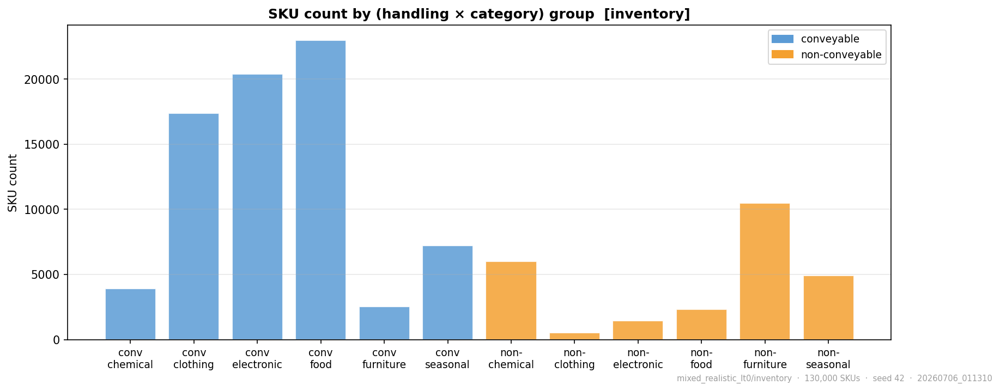
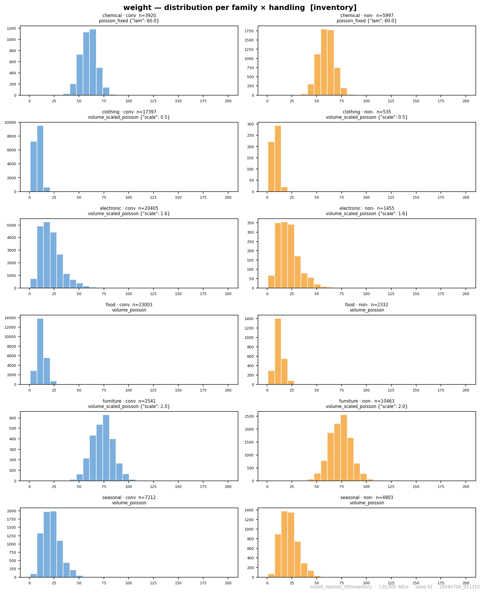
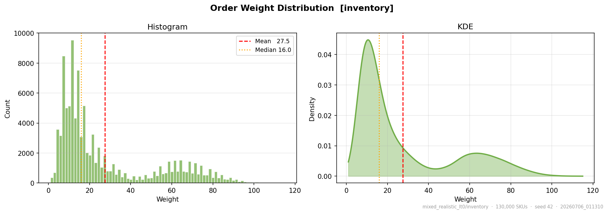
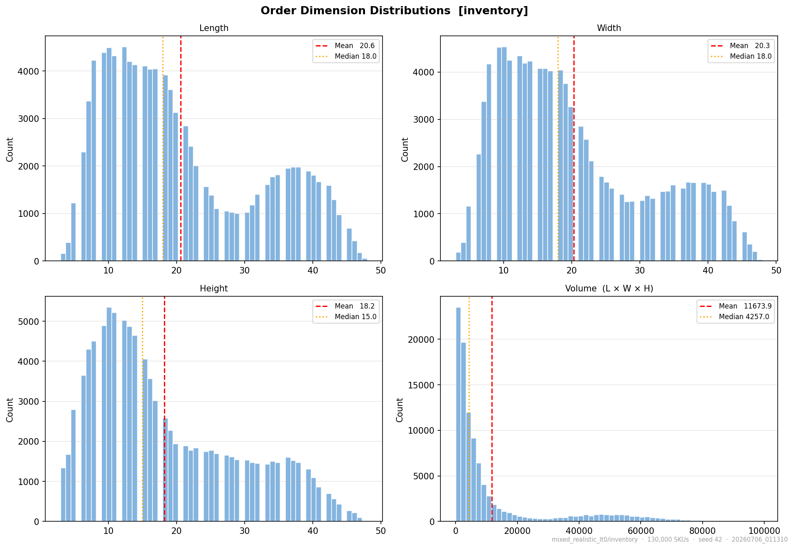
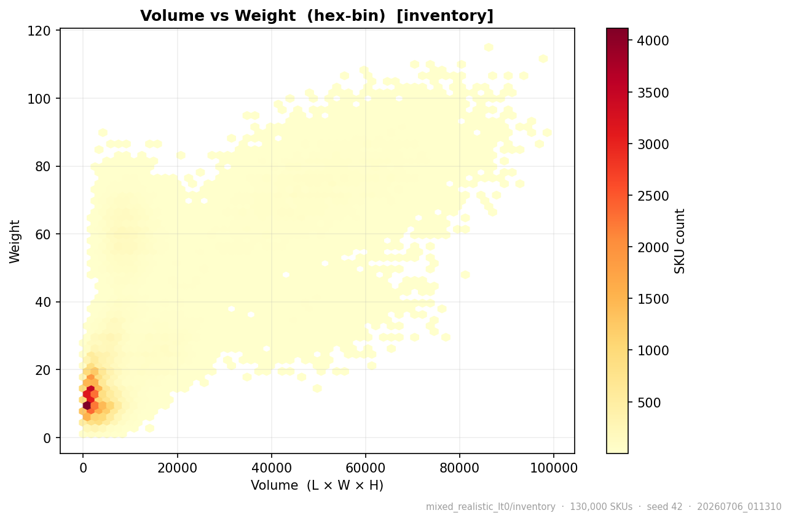
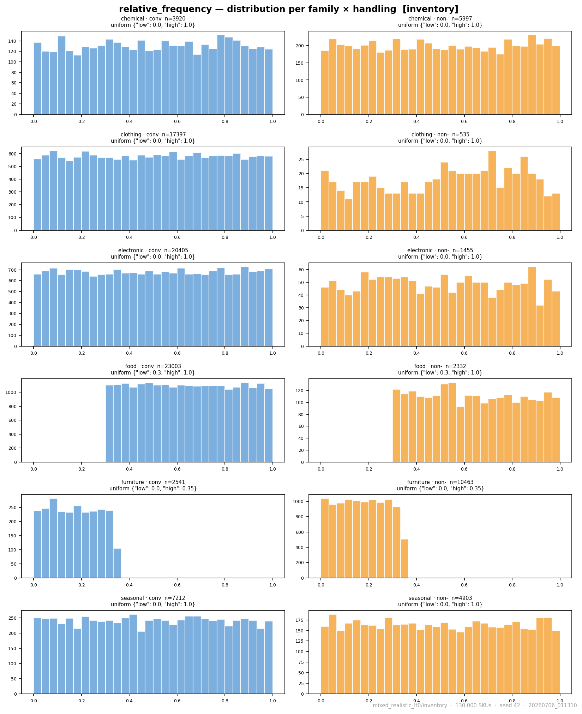
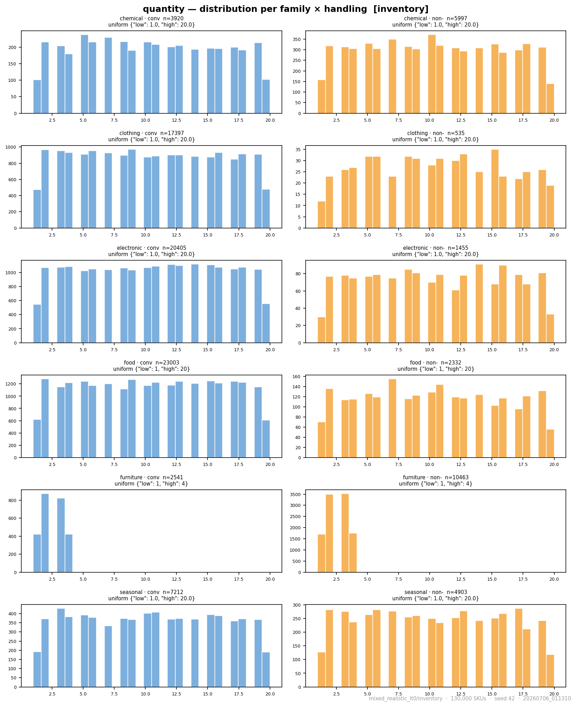
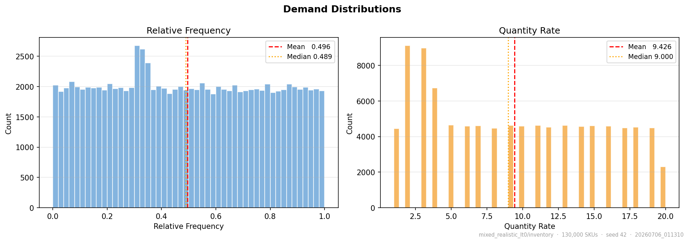
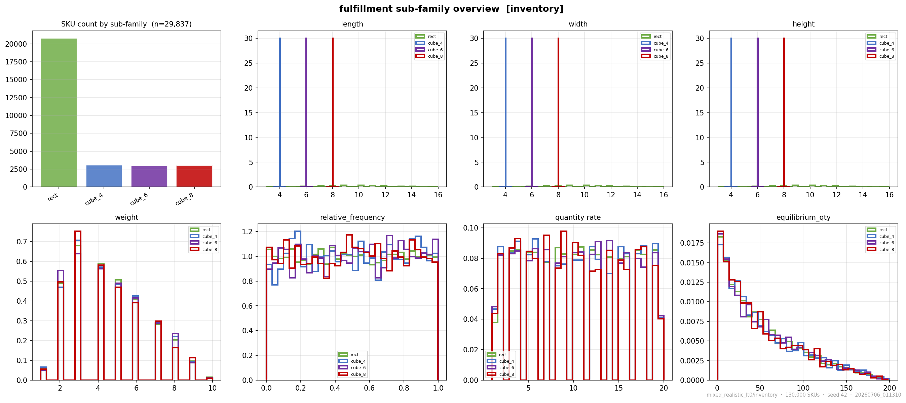
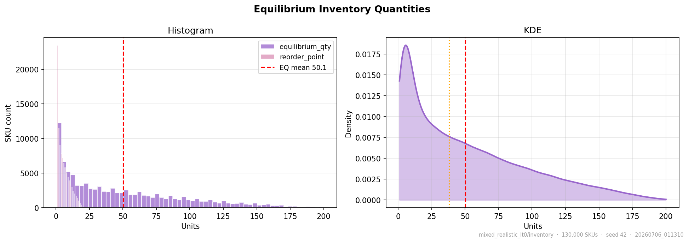

# Inventory baselines

Both warehouses in Experiment 2 are stocked from **one** synthetic SKU catalogue — the
**`mixed_realistic`** catalogue: 130,000 SKUs drawn from six product categories (split by
conveyable/non-conveyable handling into eight creation-plan entries), each with its own size,
weight, handling, and demand distributions. This page is the **baseline**: the catalogue exactly
as the simulation used it. The two lead-time variants (`lt0`, `ltrand0-5`) and both channels
(store, fulfillment) share this seed-42 catalogue, so any performance difference between runs is
attributable to placement, calibration, or lead time — **never** to a different inventory.

The tables and plots below are generated directly from the committed `params.json` snapshot and
the catalogue's own generation plots, so they always match what the simulation actually ran.

!!! note "One catalogue, two lead-time variants, two warehouses"
    `mixed_realistic_lt0` uses **{{ inv_lead_time('lt0') }}** replenishment, while
    `mixed_realistic_ltrand0-5` uses **{{ inv_lead_time('ltrand') }}**. Everything else —
    seed {{ inv_params('lt0')['seed'] }}, {{ '{:,}'.format(inv_params('lt0')['num_skus']) }} SKUs,
    the creation plan below, the supply coefficient-of-variation ceiling, and the
    {{ inv_params('lt0')['equilibrium_coverage_batches'] }}-batch equilibrium coverage — is
    **identical** between them and between the store and fulfillment channels.

## Category creation plan

Shares, dimension distributions (inches), weight model, conveyable/non-conveyable handling split,
and per-SKU order **freq**uency and **qty** ranges:

{{ inv_distribution_table('lt0') }}

**Reading the specs:** `tri(a–b, mode m)` is a triangular distribution; `norm(μ, σ)` a normal;
`U(a–b)` a uniform draw; `mix(p·… + q·…)` a probabilistic mixture of components. Weights are
Poisson-distributed and scaled by item volume (`∝ volume`), optionally with a category multiplier,
except chemicals which use a fixed rate.

## Category shares &amp; handling

<figure markdown>
  { width=820 }
  <figcaption>Distribution of categories — SKU count per (handling × category) group. Food,
  electronic, and clothing dominate; furniture skews non-conveyable.</figcaption>
</figure>

## Weight distributions

The item **weight** drives the handling term $h$ in both channels' pick-time cost (the store
channel especially, with its $w^{1.5}$ / $w^{2}$ penalty). Weight is Poisson-distributed and, for
most categories, scaled by item volume, so heavier categories are also the bulkier ones.

<figure markdown>
  { width=820 }
  <figcaption>Weight (lb) distribution per (category × handling). Chemicals sit at a fixed
  Poisson(λ=60); furniture is the heaviest volume-scaled family; clothing and food are light.</figcaption>
</figure>

<figure markdown>
  { width=820 }
  <figcaption>Catalogue-wide weight distribution across all 130,000 SKUs.</figcaption>
</figure>

## Volume distributions

**Volume** ($L \times W \times H$) feeds the volume handling term ($\log_2 V$ for store,
$\log V$ for fulfillment) and, via the weight model, most of the weight too. The dimension
distributions below define it; the hex-bin shows the volume–weight relationship the cost models
lean on.

<figure markdown>
  { width=820 }
  <figcaption>Length / width / height distributions (inches) whose product is the item
  volume.</figcaption>
</figure>

<figure markdown>
  { width=820 }
  <figcaption>Volume ($L\times W\times H$) vs weight, hex-binned by SKU count. The dense
  low-volume/low-weight corner is the small-parts mass; the diagonal ridge is the
  volume-scaled-weight families (furniture, electronics).</figcaption>
</figure>

## Relative-frequency distributions

A SKU's **relative pick frequency** $f_s$ is its selection weight as a **[0, 1] share** (not an
absolute rate) — it decides how often a SKU is sampled into a batch, and therefore how much a
good placement is worth for it. This is the single most important demand lever the assignment
functions exploit: hot SKUs are the ones worth putting up front.

<figure markdown>
  { width=820 }
  <figcaption>Relative pick-frequency (a [0, 1] share) distribution per (category × handling).
  Note food's <code>U(0.3–1.0)</code> floor (always fairly hot) and furniture's
  <code>U(0–0.35)</code> cap (never hot).</figcaption>
</figure>

<figure markdown>
  { width=820 }
  <figcaption>Quantity-rate distribution per (category × handling); furniture is capped at
  <code>U(1–4)</code>, most others span <code>U(1–20)</code>. Frequency × quantity is a SKU's
  demand mass.</figcaption>
</figure>

<figure markdown>
  { width=820 }
  <figcaption>Catalogue-wide demand: relative pick-frequency (≈U(0,1)) and quantity rate.</figcaption>
</figure>

## Fulfillment-channel view of the same catalogue

The fulfillment channel re-slices the identical catalogue into its own conveyable subfamilies.
The distributions are the same SKUs; the grouping reflects how the fulfillment operation buckets
them.

<figure markdown>
  { width=820 }
  <figcaption>Fulfillment subfamily overview — how the shared catalogue is bucketed for the
  fulfillment channel.</figcaption>
</figure>

## Derived stock targets

The catalogue and its steady-state stock levels are produced by
[`Warehouse/generation/generate_inventory.py`](https://github.com/EdgyPage/Inventory_Location_Optimizer/blob/main/Warehouse/generation/generate_inventory.py).
Each SKU is assigned an equilibrium quantity and a reorder point from its expected demand:

!!! abstract "Equilibrium / reorder model"
    {{ reorder_formula('lt0', 'store') }}

    The warehouse is sized so every SKU can hold its equilibrium quantity; the reorder point
    triggers replenishment `lead + safety` batches ahead of stock-out. In the `lt0` variant
    orders arrive immediately; in `ltrand0-5` they arrive after a uniform 0–5 batch delay, so
    stock can dip below the reorder point before it is refilled.

<figure markdown>
  { width=820 }
  <figcaption>Derived stock targets: equilibrium quantity and reorder point, from each SKU's
  expected demand via the model above.</figcaption>
</figure>

See the [Highlights](highlights.md) for how each channel's winning strategy performs on this
catalogue, and [Everything else](everything-else.md) for the full strategy suite.
