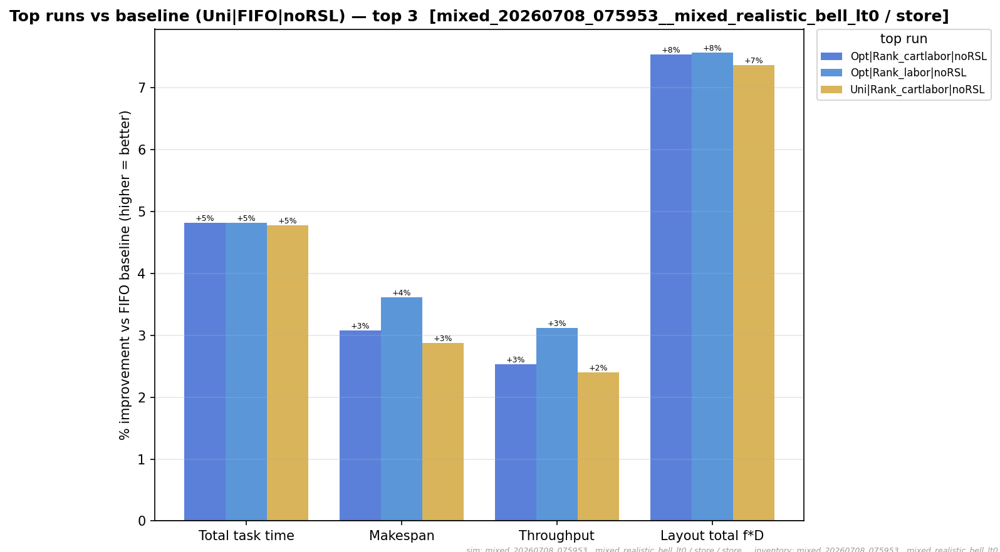
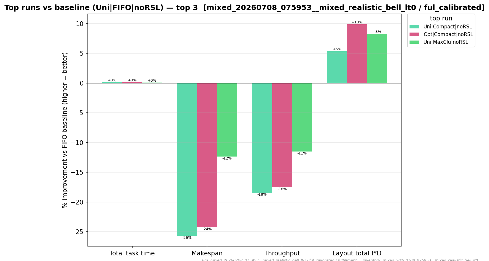

# Full results

The two spotlight cells arm-by-arm: the **winner** `k2_l0_off` (split ×2, no loss, no zoning) and the
**baseline** `k1_off` (no split, no zoning). The [comparison](comparison.md) covers the full 9-cell
matrix at the median level; this is the within-cell drill-down for the two endpoints of the headline
result. Every [assignment function](formula-reference.md) under both initial layouts is shown.

!!! note "What to look for"
    Two things. **(1)** In `k2_l0_off` the whole frontier shifts up vs the FIFO baseline — the split
    helps essentially every arm, not just the winners. **(2)** Comparing the two cells, the arm
    *ranking* barely changes: the split is an additive geometric gain layered on top of whatever the
    assignment function already does, which is why `uni` and `opt` land together.

## Winner — `k2_l0_off` (split ×2, no capacity loss)


### {{ inv.label }}

{{ setup_table(key) }}

{{ full_suite_section(key) }}


## Baseline — `k1_off` (no split, no zoning)

The reference layout every cell is diffed against. Top-vs-FIFO for each channel on the `bell · lt0`
inventory (the split figures above are the same views one layer up the matrix):

<figure markdown>
  { width=820 }
  <figcaption>Store channel, baseline layout — top arms vs the FIFO baseline.</figcaption>
</figure>

<figure markdown>
  { width=820 }
  <figcaption>Fulfillment channel, baseline layout — top arms vs the FIFO baseline.</figcaption>
</figure>

!!! note "The full grid"
    The complete cross-cell delta is 2,176 rows (8 non-reference cells × 34 arms × 4 pick-configs ×
    2 inventories) in `whatif_delta.csv`; the [comparison](comparison.md) table and scatter summarise
    it. The other seven cells (the zoned and capacity-loss layouts) are not re-plotted here — the
    matrix table already shows they land at or below the baseline, so `k2_l0_off` and `k1_off` bound
    the useful range.
