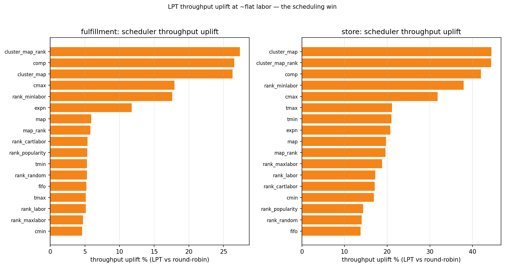
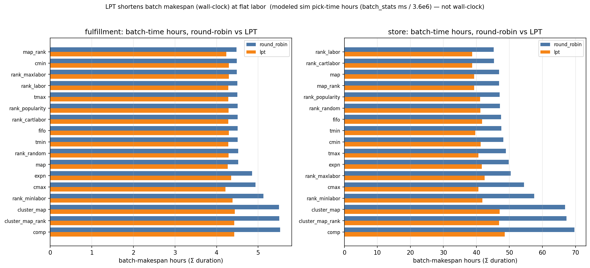
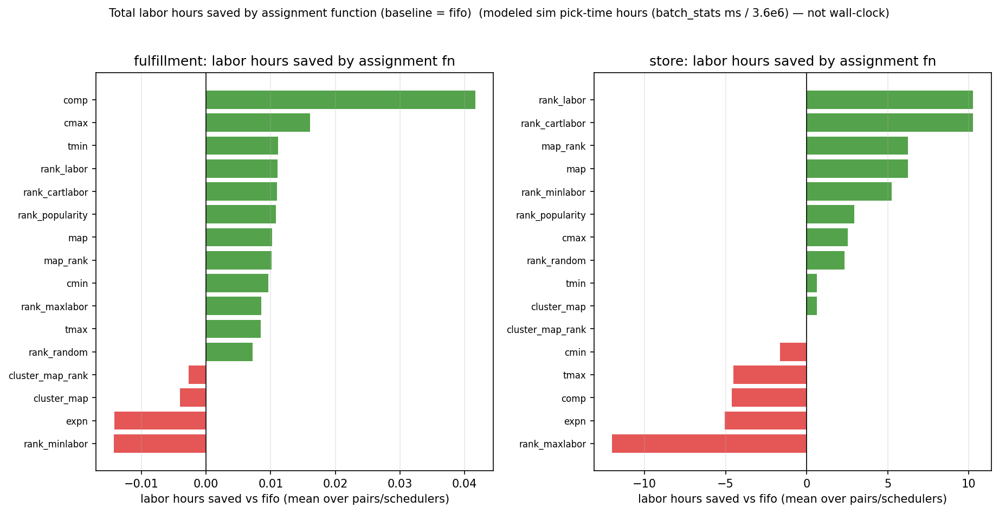

# {{ experiment().title }} — comparison

<!-- The run write-up. Fill the Summary/Discussion prose; the matrix table, charts, figures and
     formulas resolve from experiment.yml + data/whatif_delta.json. -->

!!! note "Summary"
    Across the two-cell scheduler A/B, **the scheduler is the throughput lever and the assignment
    function is the labor lever — and they are orthogonal**. Swapping round-robin (**`k1_off_rr`**)
    for **LPT** load-balancing (**`k1_off_lpt`**) lifts steady-state throughput to a **≈ +20% store /
    ≈ +5% fulfillment** median, improving **every one of the 34 arms on both channels**, while
    **total labor (task makespan) stays flat to ≈ 0%** — LPT re-packs the same task-seconds into a
    shorter batch makespan, it does not remove work. The *labor* differences instead come from the
    **assignment function**: labor-balancing `Rank_labor` / `Rank_cartlabor` / `Map` save the store
    channel up to **≈ 10 modeled hours per 100 batches** vs FIFO; the adversarial `rank_maxlabor`
    *adds* ≈ 13. Fulfillment labor barely moves with the assignment function (±0.05 h) — its only
    lever here is the scheduler.

!!! warning "Modeled hours, not wall-clock"
    Every "hour" on this page is **modeled sim pick-time** — the batch-stats millisecond totals
    divided by 3.6 M ms/h (see the [Formula reference](formula-reference.md#modeled-hours)). It is a
    comparable *effort* figure across arms and schedulers, **not** a wall-clock schedule or a
    staffing estimate.

## Setup

**Pick-time cost model** (per-channel calibrations — store `StoreCart`, fulfillment
`FulfillmentCart`; full model + all calibrations on the [Formula reference](formula-reference.md)):

{{ pick_time_formula((experiment().inventories.keys() | list) | first) }}

{{ pick_calibration_table((experiment().inventories.keys() | list) | first) }}

**Assignment functions.** Every cell runs the full 17-family × {uni, opt} suite (34 arms); the
three highlighted here are the store's biggest **labor-hours** savers (full catalogue on the
[Formula reference](formula-reference.md)):

{{ assignment_formulas() }}

## The scheduler A/B

One frozen inventory + one batch stream is run through two picker **schedulers**, layout and zoning
pinned off:

- **`k1_off_rr` — round-robin** (the reference). Tasks are handed to the $K$ pickers in aisle order,
  round-robin — simple, but a picker can draw a run of heavy aisles and become the batch's
  bottleneck.
- **`k1_off_lpt` — LPT** (longest-processing-time). Each task goes to the picker who will finish
  earliest, longest tasks placed first — the classic list-scheduling heuristic for minimising
  makespan on identical machines. Same tasks, same total work; only the *packing* changes.

{{ whatif_matrix() }}

<figure markdown>
  .whatif.scatter }}){ width=860 }
  <figcaption>One point per (scheduler × assignment fn): x = total modeled labor hours
  (Σ task-makespan), y = throughput (items/hour). Colour = scheduler. Within each labor band the
  LPT (orange) points sit <em>above</em> the round-robin (blue) — more throughput at the same
  labor — and the leftmost points (least labor) are the labor-balancing assignment functions.</figcaption>
</figure>

## Lever 1 — the scheduler buys throughput at flat labor

<figure markdown>
  { width=860 }
  <figcaption>Throughput uplift % (LPT vs round-robin) per assignment fn, per channel. The store
  channel (25 pickers) gains a ≈ +20% median; fulfillment (20 walkers) ≈ +5%. The uplift is broadly
  flat across assignment functions — it is a property of the <em>scheduler</em>, not the placement.</figcaption>
</figure>

- **Store throughput ≈ +20%, fulfillment ≈ +5%, every arm.** LPT improves 100% of the 34 arms on
  both channels; `uni` and `opt` initial layouts land together. The store channel gains more because
  with 25 pickers and longer store aisles there is more picker-to-picker imbalance for LPT to
  absorb; fulfillment's shorter walker tasks are already near-balanced under round-robin.
- **Labor is untouched.** The matrix above shows Δtask-makespan (labor) ≈ 0% for both channels: LPT
  changes *when* each task-second is done, not *how many* there are. Throughput ÷ task-makespan is
  likewise flat; throughput ÷ **batch** makespan is the whole gain.

<figure markdown>
  { width=860 }
  <figcaption>Total batch-makespan hours (Σ wall-clock per batch) per assignment fn — round-robin
  vs LPT. LPT's bars are uniformly shorter: the batch clears sooner at unchanged total labor.</figcaption>
</figure>

## Lever 2 — the assignment function saves labor hours

<figure markdown>
  { width=860 }
  <figcaption>Total modeled labor hours saved vs the FIFO arm (per channel, mean over pairs and
  schedulers). Store: <code>Rank_labor</code> / <code>Rank_cartlabor</code> save ≈ +10 h per 100
  batches, <code>Map</code> / <code>Map_rank</code> ≈ +6 h; the adversarial <code>rank_maxlabor</code>
  <em>costs</em> ≈ −13 h. Fulfillment barely moves (±0.05 h) — a single-item-dominated channel.</figcaption>
</figure>

- **Store labor is the assignment function's to move.** The labor-balancing family (`Rank_labor`,
  `Rank_cartlabor`) leads, then the map family (`Map`, `Map_rank`); the bracket controls
  (`rank_maxlabor`, `expn`, `comp`) land below FIFO by design. Because labor is
  scheduler-independent, these savings hold identically under round-robin and LPT.
- **Fulfillment labor is flat.** The fulfillment channel's tasks are near single-item, so placement
  choices barely change total pick-time — its assignment-function labor spread is ±0.05 h. This is
  the counterpoint to the store result: where a channel has little within-aisle labor to
  redistribute, the assignment lever has little to grab, and only the scheduler moves the needle.

## Discussion

The two results describe **two independent knobs on the same batch stream**. Total labor — the sum
of every task's pick-time — is fixed once the *placement* is chosen: it is a property of which bins
hold which SKUs, and a scheduler only decides the order pickers walk to them. So the **assignment
function** owns labor (how much total picking work a batch contains) and the **scheduler** owns
throughput (how tightly that fixed work packs across pickers into a short makespan). They compose:
the best cell here is LPT (for throughput) running a labor-balancing assignment function (for
labor), and neither choice erodes the other.

The practical read: **pick a load-balancing scheduler for throughput and a labor-balancing
assignment function for labor — they don't trade off.** Open follow-ups: (a) whether an even smarter
scheduler (e.g. work-stealing) extends the store's +20% or hits a task-granularity floor, and
(b) whether a *labor* lever exists for the fulfillment channel at all — nothing in the assignment
suite moved it here. See [Full results](full-results.md) for both scheduler cells arm-by-arm.
