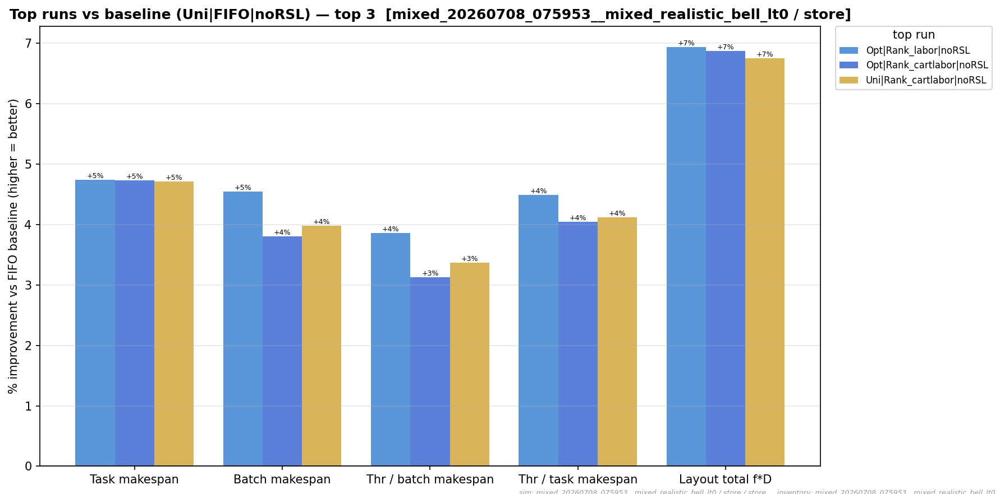
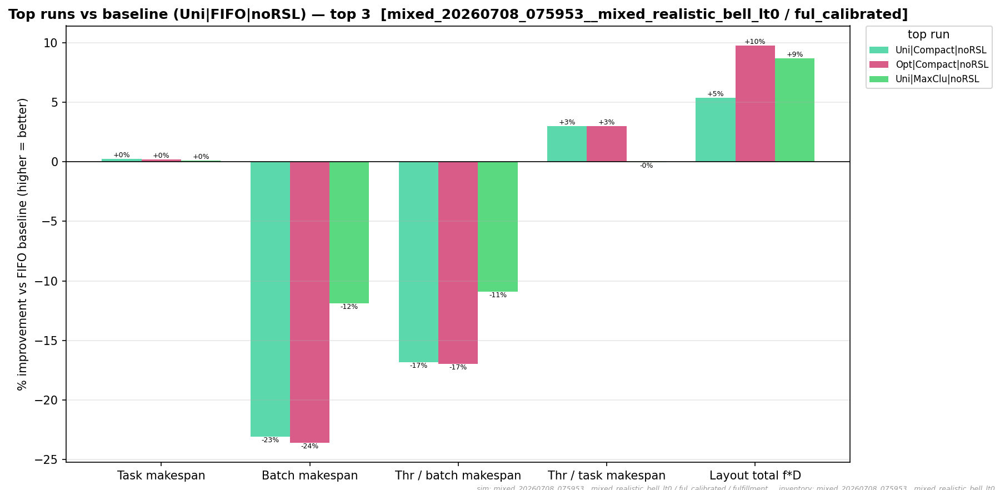

# Full results

The two scheduler cells arm-by-arm: the **LPT winner** `k1_off_lpt` and the **round-robin baseline**
`k1_off_rr` (both no split, no zoning). The [comparison](comparison.md) covers the scheduler A/B and
the labor-hours charts at the median level; this is the within-cell drill-down. Every
[assignment function](formula-reference.md) under both initial layouts is shown.

!!! note "What to look for"
    Two things. **(1)** Within a cell, the arm ranking is the **labor** story: the labor-balancing
    and map families sit at the top of the frontier and the bracket controls (`rank_maxlabor`,
    `expn`, `comp`) below FIFO — identical under both schedulers, because the scheduler doesn't touch
    total labor. **(2)** Comparing the two cells, that ordering barely moves; what changes is the
    **batch makespan** (and hence throughput), which the [comparison](comparison.md) charts isolate.
    All hours here are **modeled sim pick-time**, not wall-clock.

## Winner — `k1_off_lpt` (LPT load-balancing scheduler)


### {{ inv.label }}

{{ setup_table(key) }}

{{ full_suite_section(key) }}


## Baseline — `k1_off_rr` (round-robin scheduler)

The reference scheduler every throughput delta is measured against. Top-vs-FIFO for each channel on
the `bell · lt0` inventory (the arm ordering matches the LPT cell above; only the makespan differs):

<figure markdown>
  { width=820 }
  <figcaption>Store channel, round-robin scheduler — top arms vs the FIFO baseline.</figcaption>
</figure>

<figure markdown>
  { width=820 }
  <figcaption>Fulfillment channel, round-robin scheduler — top arms vs the FIFO baseline.</figcaption>
</figure>

!!! note "The full grid"
    The complete cross-scheduler delta and the labor-hours totals are in `whatif_labor.csv` (272 rows
    = 2 cells × 34 arms × 2 channels × 2 inventories) and `whatif_delta.csv`; the
    [comparison](comparison.md) table and four charts summarise them. The scheduler changes batch
    makespan (throughput) at flat task makespan (labor), so the two cells bound the useful range:
    same labor, different throughput.
