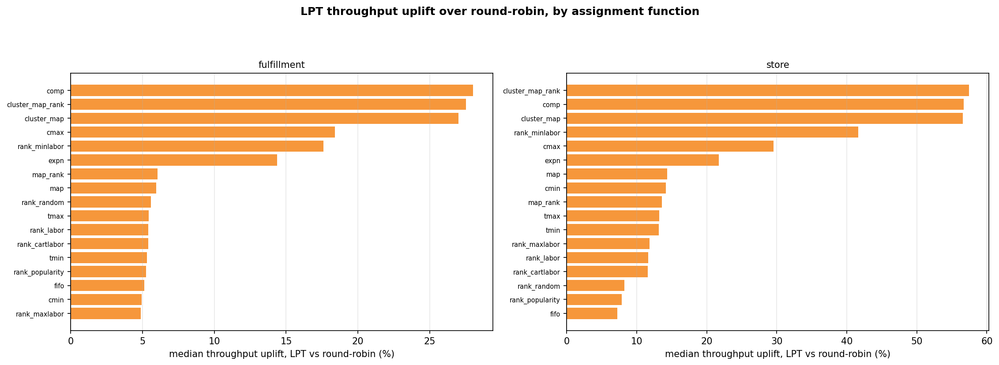

# Throughput — the scheduler lever

*This is the evidence page for the throughput half of the [Results](index.md) summary. Start there
if you want the finding; read on for how it was measured and what it does not show.*

!!! note "Summary"
    The picker **scheduler** and the **assignment function** move two different quantities, and this
    experiment measures them as *rates* rather than as end-of-run scalars. Swapping round-robin
    (**`k1_off_rr`**) for **LPT** load-balancing (**`k1_off_lpt`**) raises throughput by a median
    **+13.7 % on store** and **+5.6 % on fulfillment** — while total labor moves by
    **−0.000 % and +0.000 %** respectively. Across all 68 LPT arms per channel, labor changes by at
    most **±0.07 %**. LPT therefore does not remove work; it removes picker *idle* time, so the same
    work finishes sooner.
      
    All figures on this page are quoted from `whatif_volume.csv`, written by
    `Optimization/run_whatif_volume.py`, and reconcile with `whatif_labor.csv` to nine decimal
    places on `labor_hours` across all 272 arm-rows.

!!! warning "Modeled hours, not wall-clock"
    Every "hour" here is **modeled sim pick-time** — batch-stats milliseconds ÷ 3.6 M
    (see the [Formula reference](formula-reference.md)). It is a comparable *effort* figure across
    arms and schedulers, **not** a wall-clock schedule or a staffing estimate.

## Why throughput and labor are different questions

A warehouse can improve in two unrelated ways, and conflating them is the usual reporting error.

- **Labor** is *how much work there is*: the sum of task time, which one picker would incur working
  alone. Placement decides it — a better assignment function means less travel per item.
- **Throughput** is *how fast the work clears*: items per elapsed hour. Scheduling decides it —
  balancing tasks across pickers removes the idle time at the end of a batch, when everyone waits
  on whoever drew the heaviest aisle.

Either can improve without touching the other, and this run separates them cleanly.

## Reading the rate directly

<figure markdown>
  .whatif.scatter }}){ width=920 }
  <figcaption>Cumulative items picked (y) against elapsed hours (x), for one assignment arm under
  both schedulers. The <strong>slope is throughput</strong> and the dot is the finish. Both lines
  reach the same height — the same work — but the LPT line is steeper and stops sooner.
  Source: <code>whatif_volume_curves.png</code>.</figcaption>
</figure>

That picture is the whole argument. For the store's best arm, `opt_rank_labor_norsl` on the
`bell_lt0` inventory:

| | round-robin | LPT | change |
|---|---:|---:|---:|
| throughput (items / h) | 553,477 | 627,725 | **+13.4 %** |
| elapsed hours | 13.295 | 11.724 | **−11.8 %** |
| **labor hours** | **249.096** | **249.101** | **+0.002 %** |
| items picked | 7,358,481 | 7,359,250 | +0.01 % |

<small>All five rows read from `whatif_volume.csv`, keys `k1_off_rr` / `k1_off_lpt` × `store` ×
`opt_rank_labor_norsl` × `mixed_20260708_075953__mixed_realistic_bell_lt0`.</small>

Labor is unchanged to three decimal places while throughput rises 13 %. The work was identical; only
its packing across pickers changed.

## The area metric, and an honest caveat about it

A natural instinct is to summarise such a curve by its **area** — total item-hours under it. On this
data that would mislead, and it is worth saying why rather than quietly not doing it.

The cumulative curve is very nearly a straight line from the origin. The **shape index**
(area ÷ the area of the triangle its own endpoints define) sits between **0.9867 and 1.0254 across
all 272 arm-rows** in `whatif_volume.csv`. A perfectly straight line scores exactly 1.000, and its
area is then fixed by its endpoints alone — so a raw "AUC" would be a restatement of
*items × hours ÷ 2*, dressed up as a shape measurement.

Three numbers are reported instead, and only the first two measure performance:

| metric | meaning | direction |
|---|---|---|
| `mean_thr_items_hr` | items ÷ elapsed hours — the chord slope | **higher is better** |
| `auc_gain_vs_ref_pct` | area *between* this curve and round-robin's, over round-robin's own area | **higher is better** |
| `shape_index` | area ÷ (T·I/2) | **≈1.000 expected** — a stability diagnostic, *not* a score |

The second carries information a bare rate does not: two straight lines of different slope diverge
steadily, so the area between them answers *"by any given hour, how much more work is finished?"*
For store it is **+13.9 %** median, for fulfillment **+5.5 %** (`auc_gain_vs_ref_pct`,
`whatif_volume.csv`) — closely tracking the throughput figures, which is what one should expect when
the curves really are this straight. Treat it as a consistency check, not a second finding.

The shape index earns its place negatively: because it stays near 1.000 for every arm, the pick rate
did **not** sag or ramp over the run. That is the evidence for *not* claiming a warm-up effect.

## Per-arm view, within a single cell

<figure markdown>
  .run }}/{{ experiment().inventories.bell_lt0.id }}/store/top3_by_initial_volume_curve.png){ width=920 }
  <figcaption>Left: the top-3 arms per initial family against the FIFO baseline — six near-identical
  straight lines, the degeneracy described above made visible. Right: each arm's lead over FIFO at
  matched elapsed time, where the arms separate cleanly.
  Source: <code>top3_by_initial_volume_curve.png</code> (store, <code>bell_lt0</code>,
  cell <code>{{ experiment().run }}</code>).</figcaption>
</figure>

Here the lever is the **assignment function**, not the scheduler: the arms differ in how much work
they create, so unlike the scheduler comparison above they do **not** all reach the same volume.
Across the store's 34 arms, total items span **6.8 %** and elapsed hours span **69 %** (`items` and
`elapsed_hours`, `whatif_volume.csv`) — which is why throughput, a ratio, is the comparable quantity,
and why the right-hand panel compares at *matched* time rather than at the finish.

{{ whatif_matrix() }}

!!! note "Why this table says +12.8 % and the summary above says +13.7 %"
    They are the same effect measured over two windows, and the difference is the whole gap
    between them. This table is generated from `data/whatif_delta.json`, whose medians are taken
    over the **last 50 batches** — the steady-state window. The **+13.7 %** headline comes from
    `whatif_volume.csv` and is the **full-run** chord slope, every batch included. Neither is a
    correction of the other; a page quoting both must say which window it means, and the ~0.9 pp
    between them is the size of the early-run transient.

## Scheduler uplift across every assignment function

<figure markdown>
  { width=920 }
  <figcaption>Median throughput uplift of LPT over round-robin, per assignment function, faceted by
  channel. Every bar is positive: the scheduling win does not depend on which placement policy is in
  use. Source: <code>whatif_volume_uplift_bars.png</code>.</figcaption>
</figure>

## Discussion

**Why fulfillment gains less.** Store uplift is roughly two and a half times fulfillment's
(+13.7 % vs +5.6 %). LPT can only recover imbalance that exists: fulfillment runs 187 equal-count
tasks across 20 pickers, so round-robin is already close to balanced and there is less idle time to
remove. Store task lengths vary far more, so a naive hand-out leaves a longer tail.

**What this does not show.** These are modeled effort hours, so a 13 % throughput gain is **not** a
claim that a shift finishes 13 % sooner — staffing, breaks and non-pick work sit outside the model.
It also says nothing about whether LPT is practical to dispatch on a real floor.

!!! warning "Not comparable with Experiment 5"
    [Experiment 5](../experiment-5/comparison.md) reports a larger store uplift. It is a **different
    run** — fill was 0.90 store / 0.92 fulfillment there against **0.85 on both** here, with bins
    capped at 200 k per channel — and it quotes a **different statistic**: steady-state means over
    the last 50 batches, where this page quotes full-run cumulative endpoints. Both are defensible;
    they are not the same measurement, and the two figures should not be read as a change over time.
