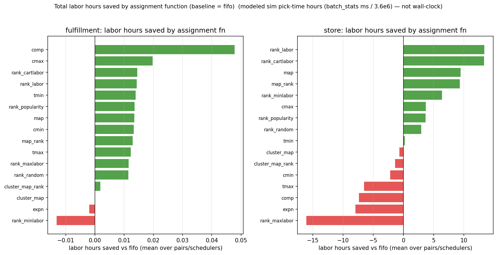

# Full results — the labor side

The [comparison write-up](comparison.md) is about **throughput**: how fast the work clears, which
the scheduler decides. This page is about **labor**: how much work there is in the first place,
which the *assignment function* decides. They are separate levers, and the scheduler moves this
page's numbers by essentially nothing.

!!! warning "Modeled hours, not wall-clock"
    "Labor hours" here is Σ task duration ÷ 3.6 M ms — the serial makespan one picker would incur
    working alone. A comparable *effort* figure, **not** a staffing estimate.

## Labor per batch, and whether the advantage holds

<figure markdown>
  .run }}/{{ experiment().inventories.bell_lt0.id }}/store/top3_by_initial_labor_per_batch.png){ width=920 }
  <figcaption>Left: labor hours per batch over batch order — thin raw line, heavy 5-batch mean, with
  each arm's last-50 mean and fitted trend in the legend. Right: the same arms as a percentage
  against FIFO <em>on the same batch</em>, which cancels the per-batch demand swing and leaves only
  the policy effect. Source: <code>top3_by_initial_labor_per_batch.png</code> (store,
  <code>bell_lt0</code>, cell <code>{{ experiment().run }}</code>).</figcaption>
</figure>

Three things read directly off that figure:

- **The raw line is dominated by demand, not policy.** Labor per batch swings between roughly 1.4 and
  3.4 hours regardless of arm, because a batch with more items simply costs more. That is why the
  right-hand panel exists — comparing against FIFO on the *same* batch removes the swing.
- **The advantage is steady, not growing.** The store's best arms hold about **+5.8 %** less labor
  than FIFO across the whole run; the `map` variants hold **+4.3 %**. The lines are flat, so the
  saving is a property of the placement, not something that accumulates as the warehouse fills.
- **Levels:** FIFO averages **2.65 labor-hours per batch** over the last 50 batches against **2.49**
  for the best arms — read from the legend of the same figure.

The fitted trend is between **+0.04 and +0.08 hours per 100 batches** for every arm shown, i.e.
statistically flat over a 100-batch run. Nothing here decays.

!!! note "One batch is an artifact, and it is marked rather than hidden"
    The store channel's demand sample contains a single near-empty batch of about **4 items**
    against a ~74,000 median. A percentage against FIFO on that batch divides two tiny numbers, so
    its excursion is off-scale; the figure marks it with a dotted line and scales the view to the
    signal instead of to the outlier. It is **identical in all 34 arms** — the batch sequence is
    shared across arms — so it biases no comparison between policies. It is a property of the
    demand draw, not of any placement strategy.

## The scheduler does not touch labor

This is the claim the [comparison page](comparison.md) rests on, so it is worth stating with its
bound rather than as a round number. Across **68 LPT arms per channel** in `whatif_volume.csv`:

| channel | median labor delta vs round-robin | worst case across all arms |
|---|---:|---:|
| store | −0.000 % | −0.071 % … +0.074 % |
| fulfillment | +0.000 % | −0.043 % … +0.023 % |

<small>Column `labor_delta_vs_ref_pct`, `whatif_volume.csv`.</small>

A scheduler that re-packs tasks across pickers cannot change how long those tasks take — and the
data confirms it to within a tenth of a percent. So every throughput gain on the comparison page is
attributable to reduced idle time, not to reduced work.

## Where the labor savings actually come from

<figure markdown>
  { width=920 }
  <figcaption>Absolute modeled labor hours saved against the FIFO baseline, per assignment function.
  This is the placement lever — note that some arms <em>lose</em> to FIFO by design (the adversarial
  controls such as <code>rank_maxlabor</code>, which maximises rather than minimises labor).
  Source: <code>whatif_labor_saved_bars.png</code>.</figcaption>
</figure>

## Every arm


### {{ inv.label }}

{{ full_suite_section(key) }}

