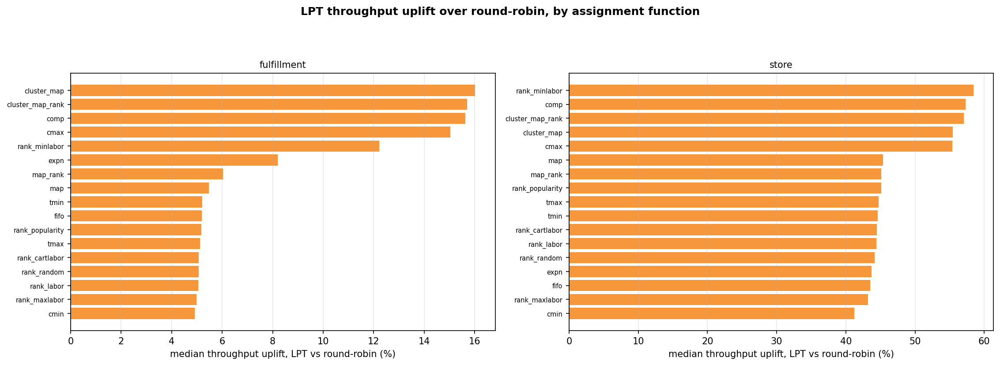

# Throughput — the scheduler lever

*This is the evidence page for the throughput half of the [Results](index.md) summary. Start there
if you want the finding; read on for how it was measured and what it does not show.*

!!! note "Summary"
    Swapping round-robin task hand-out (the `k1_off_rr` run) for **LPT** longest-task-first (the
    `k1_off_lpt` run) raises throughput by a median **+44.9 % on store** and **+5.3 % on
    fulfillment**, positive for **all 68 arms in both channels** — while hands-on labor moves by a
    median **0.001 %** and never more than **±0.06 %**. LPT does not remove work; it removes
    picker *idle* time, so the same work finishes sooner.
      
    Every figure on this page is quoted from the committed
    [`data/whatif_volume.json`](data/whatif_volume.json) (full-run rates) or
    [`data/whatif_delta.json`](data/whatif_delta.json) (steady-state window), written at the run
    root by `Optimization/run_whatif_volume.py` / `run_whatif_delta.py`.

!!! warning "Modeled hours, not wall-clock"
    Every "hour" here is **modeled pick-time** — the cost model's own output (see the
    [Formula reference](formula-reference.md)). It compares *effort* between arms and schedulers;
    it is not a wall-clock schedule or a staffing estimate. Absolute item counts and rates are
    model-scale; the percentages are the findings.

## Why throughput and labor are different questions

A warehouse can improve in two unrelated ways, and conflating them is the usual reporting error.

- **Labor** is *how much work there is*: the sum of task time, as if one picker worked alone.
  Placement decides it — a better restock rule means less travel and reach per item.
- **Throughput** is *how fast the work clears*: items per elapsed hour across the whole crew.
  Scheduling decides it — balancing tasks across pickers removes the idle time at the end of a
  batch, when everyone waits on whoever drew the heaviest aisle.

Either can improve without touching the other, and this run separates them cleanly. (They are not
the *only* levers — warehouse geometry moves throughput too, and
[Experiment 4](../experiment-4/index.md) measured it — but geometry is held frozen here so these
two read cleanly.)

## Reading the rate directly

<figure markdown>
  .whatif.scatter }}){ width=920 }
  <figcaption>Items picked so far (y) against elapsed hours (x), for one placement rule under both
  schedulers. The slope is throughput; the dot is the finish. Both lines reach the same height —
  the same work — but the LPT line is steeper and stops sooner.
  Source: <code>whatif_volume_curves.png</code>.</figcaption>
</figure>

For the store's best arm — `opt_rank_labor_norsl`, i.e. the `Rank_labor` placement rule from its
own pre-optimized start ([how arm names read](glossary.md#arm)) — on the `bell_lt0` inventory:

| | round-robin | LPT | change |
|---|---:|---:|---:|
| throughput (items / h) | 312,197 | 448,196 | **+43.6 %** |
| elapsed hours | 14.495 | 10.097 | **−30.3 %** |
| **hands-on labor hours** | **224.293** | **224.305** | **+0.005 %** |
| items picked | 4,525,242 | 4,525,287 | +0.001 % |

<small>Rows read from `data/whatif_volume.json`, keys `k1_off_rr` / `k1_off_lpt` × `store` ×
`opt_rank_labor_norsl` × `bell_lt0`.</small>

Labor is unchanged to two decimal places while the day compresses by 30 %. The work was identical;
only its packing across the 25 pickers changed. Put as a utilization figure: under round-robin the
crew is hands-on for ~62 % of the elapsed day; under LPT, ~89 %. (Your building's utilization will
differ — the mechanism, idle time pooling at the end of every batch, is what carries over.)

## One effect, two measurement windows

Two summaries of the same series appear on this site, and they agree — quoting both is a
robustness check, not a contradiction:

| window | store | fulfillment | source |
|---|---:|---:|---|
| full run (chord slope, every batch) | **+44.9 %** | **+5.3 %** | `data/whatif_volume.json` |
| steady state (median, last 50 batches) | **+45.6 %** | **+5.4 %** | `data/whatif_delta.json` |

The gap between the windows (≲ 0.7 pp) is the size of the early-run transient. Any page quoting a
scheduler uplift says which window it means; the [Results](index.md) headline uses the full-run
number.

{{ whatif_matrix() }}

## The area metric, and an honest caveat about it

*(A methods section for the technically minded — skip freely; nothing later depends on it.)*

A natural instinct is to summarise a cumulative curve by its **area**. On this data that would
mislead: the curves are very nearly straight lines from the origin — the **shape index** (area ÷
the triangle its own endpoints define) sits between **0.9934 and 1.0261 across all 272 arm-rows**
— so a raw AUC would restate *items × hours ÷ 2* and dress it up as a shape measurement.

Three numbers are reported instead, and only the first two measure performance:

| metric | meaning | direction |
|---|---|---|
| `mean_thr_items_hr` | items ÷ elapsed hours — the chord slope | **higher is better** |
| `auc_gain_vs_ref_pct` | area *between* this curve and round-robin's | **higher is better** |
| `shape_index` | area ÷ (T·I/2) | **≈1.000 expected** — a diagnostic, *not* a score |

The area-between-curves lands at **+43.6 % store / +5.3 % fulfillment** median — tracking the
throughput figures, as it must when the curves are this straight. The shape index earns its place
negatively: staying near 1.000 for every arm is the evidence that the pick rate did **not** sag or
ramp over the run, i.e. no warm-up artifact inflates the comparison.

## Scheduler uplift across every placement rule

<figure markdown>
  { width=920 }
  <figcaption>Median throughput uplift of LPT over round-robin, per placement rule, faceted by
  channel. Every bar is positive: the scheduling win does not depend on which placement policy is
  in use. Source: <code>whatif_volume_uplift_bars.png</code>.</figcaption>
</figure>

Within the store's 34 arms, total items picked span only **0.3 %** while elapsed hours span
**7.3 %** — placement changes how long the work takes far more than how much gets picked, which is
why throughput (a ratio) is the comparable quantity.

## Discussion

**Why the store gains so much more.** LPT can only recover imbalance that exists. Fulfillment's
small-cart, short-trip tasks are already near-uniform, so round-robin leaves little idle time to
reclaim (+5 %). Store tasks vary widely in length — one heavy aisle can hold the whole batch open —
so longest-first dispatch recovers a large tail (+45 %).

**Why this number is bigger than Experiment 6's — and why that strengthens the case.** Same
design, different catalogue: this inventory loads the store's aisles less evenly, so there is more
imbalance for LPT to remove (+45 % here vs +13.7 % there). The *magnitude* belongs to the
catalogue — a building with even workloads should expect the low end, a lumpy one the high end.
The *sign* does not: across two very different catalogues and 136 arm-comparisons, the gain has
never been negative and has never cost labor. That is the transferable finding.

**What a pilot adds.** These are modeled hours: a 45 % modeled gain is not a claim that a shift
ends 45 % sooner — staffing, breaks, and non-pick work sit outside the model. What the model
establishes is that the effect is real, one-directional, and free; what a pilot prices is its size
on a particular floor, and whether longest-first dispatch fits that floor's flow. See
[the ask](index.md#the-ask) for exactly what to measure.

!!! warning "Not comparable with Experiment 6"
    [Experiment 6](../experiment-6/comparison.md) reports **+13.7 % / +5.6 %** for the same lever
    on its own catalogue, measured on the pre-`753d01e` basis. Different run, different catalogue —
    the two magnitudes should not be read as a change over time.
