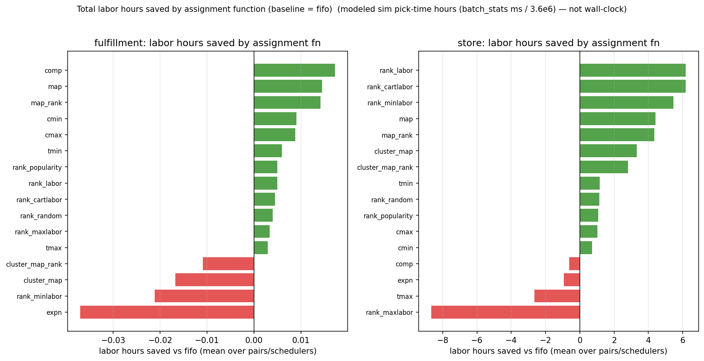

# Labor — the placement lever

*This is the evidence page for the labor half of the [Results](index.md) summary, and it carries
every arm in the sweep, including the ones that lose.*

This page is about **labor** — how much work there is, which the *placement rule* decides
(the [throughput page](comparison.md) covers the other lever). The scheduler moves this page's
numbers by essentially nothing, proven below with its bound.

!!! warning "Modeled hours, not wall-clock"
    "Labor hours" here is total task time — the serial hours one picker would incur working alone.
    A comparable *effort* figure between arms, **not** a staffing estimate.

## The headline, and where it holds

`Rank_labor` — place each arriving unit where it least burdens the busiest aisle, costliest SKU
first — is the best store rule in **every cell × inventory** of this sweep:

| channel | inventory | best rule | pick-hours saved vs FIFO |
|---|---|---|---:|
| store | `bell_lt0` | `Rank_labor` | **2.71–2.76 %** |
| store | `bell_ltrand0-5` | `Rank_labor` | **3.34–3.36 %** |
| fulfillment | `bell_lt0` | (best of 34) | 0.05–0.06 % |
| fulfillment | `bell_ltrand0-5` | (best of 34) | 0.26 % |

<small>Ranges span the two scheduler cells (`k1_off_rr`, `k1_off_lpt`) — the saving is the same
under either scheduler, which is the independence claim in one row. Source:
`channel_rollup_summary.csv` per cell; medians in
[`data/whatif_labor.json`](data/whatif_labor.json).</small>

**The fulfillment rows are a finding, not a failure.** The same rules that save 3 % in the store
move fulfillment hours by well under half a percent. Fulfillment picks ride small carts on short,
frequent trips: travel is a thin slice of each pick, so there is little for a placement rule to
save. Placement budgets should point at the store side; fulfillment's lever is the
[scheduler](comparison.md).

**What `Rank_labor` needs to run:** each SKU's demand rate and each slot's position — data any
WMS already holds. The rule fires once per restock arrival (not in the pick path), scoring
candidate slots for the arriving unit; no real-time floor telemetry is involved.

## Labor per batch, and whether the advantage holds

<figure markdown>
  .run }}/{{ experiment().inventories.bell_lt0.id }}/store/top3_by_initial_labor_per_batch.png){ width=920 }
  <figcaption>Left: labor hours per batch over batch order — thin raw line, heavy 5-batch mean.
  Right: the same arms as a percentage against FIFO <em>on the same batch</em>, which cancels the
  batch-to-batch demand swing and leaves only the policy effect.
  Source: <code>top3_by_initial_labor_per_batch.png</code> (store, <code>bell_lt0</code>, cell
  <code>{{ experiment().run }}</code>).</figcaption>
</figure>

Two things read directly off that figure:

- **The raw line is dominated by demand, not policy** — a batch with more items simply costs more.
  That is why the right-hand panel compares each arm against FIFO on the *same* batch.
- **The advantage is steady, not growing or decaying.** The saving is a property of the placement
  rule, present from early batches and holding across the run — not something that accumulates or
  erodes as the warehouse churns.

## The scheduler does not touch labor

This is the claim the [throughput page](comparison.md) rests on, so it is stated with its bound
rather than as a round number. Across **68 LPT arms per channel**:

| channel | median labor delta vs round-robin | worst case across all arms |
|---|---:|---:|
| store | +0.001 % | −0.026 % … +0.051 % |
| fulfillment | +0.001 % | −0.017 % … +0.015 % |

<small>Column `labor_delta_vs_ref_pct`, [`data/whatif_volume.json`](data/whatif_volume.json).</small>

A scheduler re-packs tasks across pickers; it cannot change how long those tasks take — and the
data confirms it to a twentieth of a percent. These bounds are exact, not sampled: the simulator
is deterministic, so each arm's two runs replay the identical day and the delta is a
recomputation with no noise floor beneath it. Every throughput gain on the throughput page is
therefore attributable to reduced idle time, not reduced work.

## Where the labor savings actually come from

<figure markdown>
  { width=920 }
  <figcaption>Modeled labor hours saved against the FIFO baseline, per placement rule. Some arms
  <em>lose</em> to FIFO by design — the suite includes deliberate worst-case controls (such as
  <code>rank_maxlabor</code>, which maximises labor) that bound how much the lever is worth in
  each direction. Source: <code>whatif_labor_saved_bars.png</code>.</figcaption>
</figure>

**Why run 34 arms when three win?** The suite is built as brackets: for every lever there is a
maximiser and a minimiser, so the distance between them measures what the lever is *worth*, and
the losers prove the winners aren't luck. Several losers are intuitive-sounding policies — cluster
co-bought items together, spread demand evenly — that an operations team might plausibly adopt,
and the sweep shows them costing more than doing nothing. The safeguard is the same one this page
uses: measure any rule against FIFO on labor per batch, and the sign tells you which side of
do-nothing it landed on. The [Formula reference](formula-reference.md#the-families) catalogues
every rule and its objective.

## Every arm

Arm names read `<starting layout>_<placement rule>`: `uni_…` starts from a random layout, `opt_…`
from the rule's own ideal layout ([glossary](glossary.md#initial-layout)). That the two starts end
up within a whisker of each other is itself a finding: the restock rule, not the starting layout,
drives the result.


### {{ inv.label }}

{{ full_suite_section(key) }}

