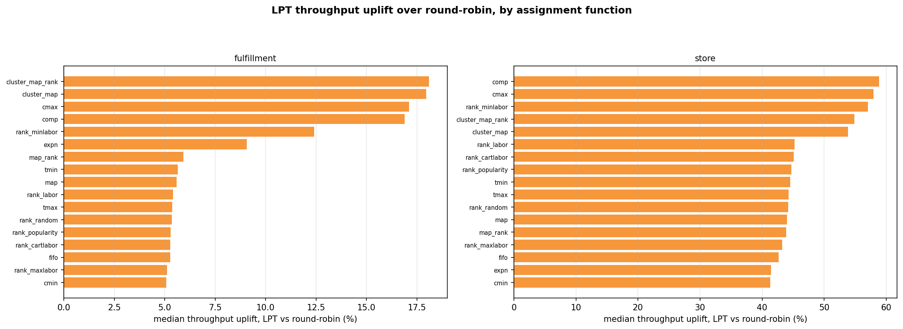

# Throughput — the scheduler lever

*This is the evidence page for the throughput half of the [Results](index.md) summary. Start there
if you want the finding; read on for how it was measured and what it does not show.*

!!! note "Summary"
    Swapping round-robin task hand-out (the `k1_off_rr` run) for **LPT** longest-task-first (the
    `k1_off_lpt` run) raises throughput by a median **+44.8 % on store** and **+5.5 % on
    fulfillment**, positive for **all 68 arms in both channels** — while hands-on labor moves by a
    median **0.007 %** and never more than **±0.07 %**. LPT does not remove work; it removes
    picker *idle* time, so the same work finishes sooner.
      
    Every figure on this page is quoted from the committed
    [`data/whatif_volume.json`](data/whatif_volume.json) (full-run rates) or
    [`data/whatif_delta.json`](data/whatif_delta.json) (steady-state window), written at the run
    root by `Optimization/run_whatif_volume.py` / `run_whatif_delta.py`.

!!! warning "Modeled hours, not wall-clock"
    Every "hour" here is **modeled pick-time** — the cost model's own output (see the
    [Formula reference](formula-reference.md)). It compares *effort* between arms and schedulers;
    it is not a wall-clock schedule or a staffing estimate. Absolute item counts and rates are
    model-scale; the percentages are the findings.

## Why throughput and labor are different questions

A warehouse can improve in two unrelated ways, and conflating them is the usual reporting error.

- **Labor** is *how much work there is*: the sum of task time, as if one picker worked alone.
  Placement decides it — a better restock rule means less travel and reach per item.
- **Throughput** is *how fast the work clears*: items per elapsed hour across the whole crew.
  Scheduling decides it — balancing tasks across pickers removes the idle time at the end of a
  batch, when everyone waits on whoever drew the heaviest aisle.

Either can improve without touching the other, and this run separates them cleanly. (They are not
the *only* levers — warehouse geometry moves throughput too, and
[Experiment 4](../experiment-4/index.md) measured it — but geometry is held frozen here so these
two read cleanly.)

## Reading the rate directly

<figure markdown>
  .whatif.scatter }}){ width=920 }
  <figcaption>Items picked so far (y) against elapsed hours (x), for one placement rule under both
  schedulers. The slope is throughput; the dot is the finish. Both lines reach the same height —
  the same work — but the LPT line is steeper and stops sooner. The channel panels sit on very
  different scales — fulfillment clears ~5–6 M items in about an hour against the store's ~2–2.5 M
  in five to eleven — because fulfillment's modeled pick is roughly 12× cheaper per item; read
  each panel's two lines against each other, not across panels.
  Source: <code>whatif_volume_curves.png</code>.</figcaption>
</figure>

For the store's best arm — `opt_rank_cartlabor_norsl`, i.e. the `Rank_cartlabor` placement rule
from its own pre-optimized start, with `norsl` = no re-slotting (existing stock stays put; only
arriving restock is steered — true of every arm in this sweep, which is why "no construction"
holds; [how arm names read](glossary.md#arm)) — on the `bell_lt0` inventory:

| | round-robin | LPT | change |
|---|---:|---:|---:|
| throughput (items / h) | 321,773 | 467,885 | **+45.4 %** |
| elapsed hours | 7.880 | 5.419 | **−31.2 %** |
| **hands-on labor hours** | **122.498** | **122.494** | **−0.003 %** |
| items picked | 2,535,622 | 2,535,381 | −0.010 % |

<small>Rows read from `data/whatif_volume.json`, keys `k1_off_rr` / `k1_off_lpt` × `store` ×
`opt_rank_cartlabor_norsl` × `bell_lt0`.</small>

Labor is unchanged to two decimal places while the day compresses by 31 %. The work was identical;
only its packing across the 25 pickers changed. Put as a utilization figure: under round-robin the
crew is hands-on for ~62 % of the elapsed day; under LPT, ~90 %. (Your building's utilization will
differ — the mechanism, idle time pooling at the end of every batch, is what carries over; in
shift terms, that pooled idle is exactly what shows up as end-of-wave dead time or as overtime
when the day runs past shift to clear. Note
what the model's "day" leaves out: breaks, lunches, and shift changes are not simulated —
utilization here is idle-at-the-end-of-batch time only. Breaks pause everyone alike, so they do
not obviously favor either scheduler, but a pilot should confirm the gain on a real shift
structure rather than assume it.)

## One effect, two measurement windows

Two summaries of the same series appear on this site, and they agree — quoting both is a
robustness check, not a contradiction:

| window | store | fulfillment | source |
|---|---:|---:|---|
| full run (items ÷ elapsed hours, every batch) | **+44.8 %** | **+5.5 %** | `data/whatif_volume.json` |
| steady state (median, last 50 batches) | **+44.2 %** | **+5.8 %** | `data/whatif_delta.json` |

The gap between the windows (≲ 0.6 pp) is the size of the early-run transient. Any page quoting a
scheduler uplift says which window it means; the [Results](index.md) headline uses the full-run
number.

{{ whatif_matrix() }}

<small>In words: the first column is how much more got picked per wave under LPT; the second is
the change in total hands-on time per task (≈ zero everywhere, which is the point).</small>

## The area metric, and an honest caveat about it

*(A methods section for the technically minded — skip freely; nothing later depends on it.)*

A natural instinct is to summarise a cumulative curve by its **area**. On this data that would
mislead: the curves are very nearly straight lines from the origin — the **shape index** (area ÷
the triangle its own endpoints define) sits between **0.9886 and 1.0299 across all 272 arm-rows**
— so a raw AUC would restate *items × hours ÷ 2* and dress it up as a shape measurement.

Three numbers are reported instead, and only the first two measure performance:

| metric | meaning | direction |
|---|---|---|
| `mean_thr_items_hr` | items ÷ elapsed hours — the chord slope | **higher is better** |
| `auc_gain_vs_ref_pct` | area *between* this curve and round-robin's | **higher is better** |
| `shape_index` | area ÷ (T·I/2) | **≈1.000 expected** — a diagnostic, *not* a score |

The area-between-curves lands at **+45.0 % store / +5.5 % fulfillment** median — tracking the
throughput figures, as it must when the curves are this straight. The shape index earns its place
negatively: staying near 1.000 for every arm is the evidence that the pick rate did **not** sag or
ramp over the run, i.e. no warm-up artifact inflates the comparison.

## Scheduler uplift across every placement rule

<figure markdown>
  { width=920 }
  <figcaption>Median throughput uplift of LPT over round-robin, per placement rule, faceted by
  channel. Every bar is positive: the scheduling win does not depend on which placement policy is
  in use. What DOES vary is its size — the headline medians (+44.8 % store, +5.5 % fulfillment) sit
  inside a spread that runs to roughly triple the fulfillment median on the cluster rules, so read
  the median as the number to plan against and this chart as the range to expect.
  Source: <code>whatif_volume_uplift_bars.png</code>.</figcaption>
</figure>

Within the store's 34 arms, total items picked span only **0.25 %** while elapsed hours span
**21.9 %** — placement changes how long the work takes far more than how much gets picked, which is
why throughput (a ratio) is the comparable quantity. (That elapsed-hours span is itself worth a
glance: at full catalogue scale the gap between the best and worst placement rule is a fifth of
the day.)

## Discussion

**Why the store gains so much more.** LPT can only recover imbalance that exists. Fulfillment's
small-cart, short-trip tasks are already near-uniform, so round-robin leaves little idle time to
reclaim (+5 %). Store tasks vary widely in length — one heavy aisle can hold the whole batch open —
so longest-first dispatch recovers a large tail (+45 %).

**Why matching Experiment 7's number strengthens the case.** Same design, same catalogue, but a
different simulated demand stream (the v2 order-draw engine) and full production scale — and the
uplift lands within a tenth of a point of Experiment 7's (+44.8 % here vs +44.9 % there). The
scheduler gain is now replicated across three demand streams and two catalogues
([Experiment 6](../experiment-6/comparison.md) read +13.7 % on a much more evenly loaded
catalogue): the *magnitude* belongs to how lumpy the aisle workloads are; the *sign* has never
been negative and has never cost labor. That is the transferable finding.

**What the model's tasks are — and are not.** A "task" here is a whole-aisle sweep, one picker
per aisle per batch, with the clock starting at the aisle's entrance; **walking between aisles is
not modeled for either scheduler**, and neither is congestion when several pickers head for long
aisles at once. Both exclusions are symmetric across the two schedulers, so they do not bias the
comparison inside the model — but a floor that dispatches at finer grain (line-level tasks,
several pickers sharing an aisle) is running a different mechanism at the edges, and the
magnitude there is untested. That, plus congestion, is what the pilot's week-one watch list is
for — and congestion arrives with a default rather than an open question: cap concurrent pickers
per aisle at the floor's existing safe number and let the scheduler skip to the next-longest
eligible task when the cap is hit ([the ask](index.md#the-ask) states the trigger to revisit it).
It costs a little of the modeled gain and it is the assumption most likely to bite on a real
floor, so it is set deliberately rather than discovered.

**What a pilot adds.** These are modeled hours: a 45 % modeled gain is not a claim that a shift
ends 45 % sooner — staffing, breaks, and non-pick work sit outside the model. What the model
establishes is that the effect is real, one-directional, and free; what a pilot prices is its size
on a particular floor, and whether longest-first dispatch fits that floor's flow. See
[the ask](index.md#the-ask) for exactly what to measure.

!!! warning "Not comparable with Experiment 7"
    [Experiment 7](../experiment-7/comparison.md) reports **+44.9 % / +5.3 %** for the same lever
    on the previous demand stream at reduced scale. The near-identical magnitudes are a
    replication, not a continuation — different simulated order sequences should not be laid on
    one axis. Current numbers come from this page.
