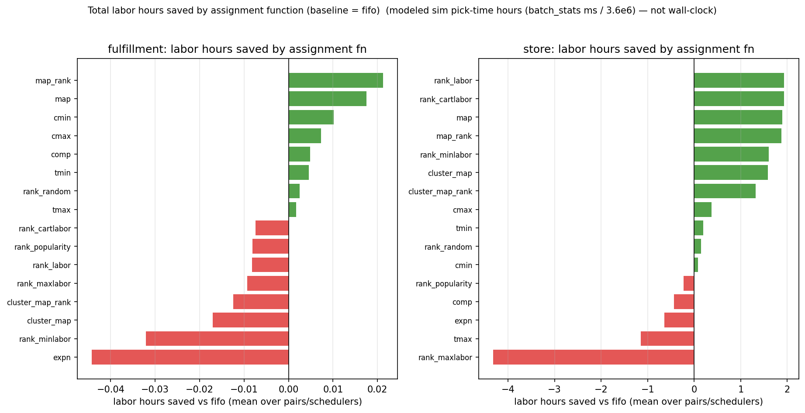

# Labor — the placement lever

*This is the evidence page for the labor half of the [Results](index.md) summary, and it carries
every arm in the sweep, including the ones that lose.*

This page is about **labor** — how much work there is, which the *placement rule* decides
(the [throughput page](comparison.md) covers the other lever). The scheduler moves this page's
numbers by essentially nothing, proven below with its bound.

!!! warning "Modeled hours, not wall-clock"
    "Labor hours" here is total task time — the serial hours one picker would incur working alone.
    A comparable *effort* figure between arms, **not** a staffing estimate.

## The headline, and where it holds

This sweep's sharpest result is a **split podium** — which placement family wins depends on how
predictable replenishment is:

| channel | inventory (supply model) | best rule | pick-hours saved vs FIFO |
|---|---|---|---:|
| store | `bell_lt0` — immediate replenishment | `Rank_cartlabor` / `Rank_labor` (tie) | **2.62–2.63 %** |
| store | `bell_ltrand0-5` — 0–5-batch lead times | `Map_rank` | **0.76–0.82 %** |
| fulfillment | `bell_lt0` | (best of 34: `Map` family) | 0.04–0.06 % |
| fulfillment | `bell_ltrand0-5` | `Map_rank` | 0.22–0.23 % |

<small>Ranges span the two scheduler cells (`k1_off_rr`, `k1_off_lpt`) — the saving is the same
under either scheduler, which is the independence claim in one row. The lt0 "tie": the two rank
rules trade first and second place between cells, 0.0055 pp apart under LPT and 0.0120 pp under
round-robin — closer than any real measurement could separate. Source: the committed per-cell
rollup summaries, [`data/k1_off_lpt/channel_rollup_summary.csv`](data/k1_off_lpt/channel_rollup_summary.csv)
and [`data/k1_off_rr/channel_rollup_summary.csv`](data/k1_off_rr/channel_rollup_summary.csv);
scheduler-invariance medians in [`data/whatif_labor.json`](data/whatif_labor.json).</small>

**Why the winner flips with supply reliability** *(a mechanism reading of the data, not a
separately ablated finding — the families differ in more than reactivity)*. The `Rank_labor`
family is *reactive*: it
scores slots against current aisle load as each restock arrives, which works when arrivals are
steady and current load predicts the near future. Random 0–5-batch lead times break that
prediction — restock lands in bursts against a layout scored for a different moment — and the
*planned* `Map` family (a fixed ideal address per product) takes the lead, at a smaller but
still-positive prize. The operational reading: **placement optimization and supply reliability
are complements** — the more predictable the replenishment, the more a smart placement rule pays.
A rule of thumb for placing your own building between the two buckets: if a triggered restock is
reliably on the shelf within the same day or wave it was requested, you are in the predictable
bucket (`Rank_labor` family); if arrival dates spread over several days you cannot predict, you
are in the variable bucket (`Map` family, smaller prize).

**The fulfillment rows are a finding, not a failure.** The same rules that save ~2.6 % in the
store move fulfillment hours by a quarter percent at best. Fulfillment picks ride small carts on
short, frequent trips: travel is a thin slice of each pick, so there is little for a placement
rule to save. Placement budgets should point at the store side; fulfillment's lever is the
[scheduler](comparison.md).

**What these rules need to run:** each SKU's demand rate and each slot's position — data any WMS
already holds (the `Map` family additionally precomputes its address map offline — recompute
cadence and ownership are on the [formula reference](formula-reference.md#map)). The rules fire
once per restock arrival (not in the pick path), scoring candidate slots for the arriving unit;
no real-time floor telemetry is involved.

**What the put-away side costs — the other half of the ledger, stated plainly.** The modeled
labor on this page counts **pick time only**: the restocker's walk to the chosen slot is not
modeled for *any* rule, FIFO included, so the 2.6 % is a pick-hours saving, not a
whole-building net. Two reasons to expect the put-away side helps rather than hurts — and one
instruction because "expect" is not evidence: the winning rules score slots with the same
travel-distance measure picks pay, so they bias restock toward **near, low** bins rather than
far ones (FIFO's "first free slot" carries no such bias); and each placement is amortized over
the many picks that later drain it (the model restocks ≈ 39 units at a time per product, so
put-away trips run far less frequent than pick visits). But on any
given arrival a computed slot can be farther than the nearest free one, and the model cannot
price that — so **the pilot's measurement must include restock-crew hours** alongside pick
hours, making the ledger complete by measurement rather than by assumption.

## Labor per batch, and whether the advantage holds

<figure markdown>
  .run }}/{{ experiment().inventories.bell_lt0.id }}/store/top3_by_initial_labor_per_batch.png){ width=920 }
  <figcaption>Left: labor hours per batch over batch order — thin raw line, heavy 5-batch mean.
  Right: the same arms as a percentage against FIFO <em>on the same batch</em>, which cancels the
  batch-to-batch demand swing and leaves only the policy effect.
  Source: <code>top3_by_initial_labor_per_batch.png</code> (store, <code>bell_lt0</code>, cell
  <code>{{ experiment().run }}</code>).</figcaption>
</figure>

Two things read directly off that figure:

- **The raw line is dominated by demand, not policy** — a batch with more items simply costs more.
  That is why the right-hand panel compares each arm against FIFO on the *same* batch.
- **The advantage is steady, not growing or decaying.** The saving is a property of the placement
  rule, present from early batches and holding across the run — not something that accumulates or
  erodes as the warehouse churns.

## The scheduler does not touch labor

This is the claim the [throughput page](comparison.md) rests on, so it is stated with its bound
rather than as a round number. Across **68 LPT arms per channel**:

| channel | median labor delta vs round-robin | worst case across all arms |
|---|---:|---:|
| store | −0.004 % | −0.041 % … +0.068 % |
| fulfillment | +0.000 % | −0.021 % … +0.017 % |

<small>Column `labor_delta_vs_ref_pct`, [`data/whatif_volume.json`](data/whatif_volume.json).</small>

A scheduler re-packs tasks across pickers; it cannot change how long those tasks take — and the
data confirms it to under a tenth of a percent. These bounds are exact, not sampled: the simulator
is deterministic, so each arm's two runs replay the identical day and the delta is a
recomputation with no noise floor beneath it. Every throughput gain on the throughput page is
therefore attributable to reduced idle time, not reduced work.

## Where the labor savings actually come from

<figure markdown>
  { width=920 }
  <figcaption>Modeled labor hours saved against the FIFO baseline, per placement rule. Some arms
  <em>lose</em> to FIFO by design — the suite includes deliberate worst-case controls (such as
  <code>rank_maxlabor</code>, which maximises labor) that bound how much the lever is worth in
  each direction. Source: <code>whatif_labor_saved_bars.png</code>.</figcaption>
</figure>

**Why run 34 arms when three win?** The suite is built as brackets: for every lever there is a
maximiser and a minimiser, so the distance between them measures what the lever is *worth*, and
the losers prove the winners aren't luck. Several losers are intuitive-sounding policies — cluster
co-bought items together, spread demand evenly — that an operations team might plausibly adopt,
and the sweep shows them costing more than doing nothing. The safeguard is the same one this page
uses: measure any rule against FIFO on labor per batch, and the sign tells you which side of
do-nothing it landed on. The [Formula reference](formula-reference.md#the-families) catalogues
every rule and its objective.

## Every arm

Arm names read `<starting layout>_<placement rule>`: `uni_…` starts from a random layout, `opt_…`
from the rule's own ideal layout ([glossary](glossary.md#initial-layout)). That the two starts end
up within a whisker of each other is itself a finding: the restock rule, not the starting layout,
drives the result.

**The numbers behind the charts.** Every arm's steady-state hours, absolute saving, and saving
percentage — all 34 rules × both channels × both inventories, winners and losers alike — are
committed as plain CSV, one row per arm:
[`data/k1_off_lpt/channel_rollup.csv`](data/k1_off_lpt/channel_rollup.csv) and
[`data/k1_off_rr/channel_rollup.csv`](data/k1_off_rr/channel_rollup.csv). In plain words, each
row names the inventory and channel, the arm (`plan_key` — the `uni_`/`opt_` names used
everywhere here; `norsl` on every arm = **no re-slotting**: existing stock stays put, only
arriving restock is steered), its steady-state pick-hours (`ss_prod_hours`), and its saving vs
FIFO in hours (`saving_abs`) and percent (`saving_pct`). The charts below are rendered from the
same run; the CSVs are the auditable source when a specific arm's exact figure is needed.

**Edge behavior the rules assume** (the operational fine print, verified against the simulator):
a placement rule scores only bins that are *free and fit the unit* — full aisles simply drop out
of the candidate set rather than being forced. Scoring ties resolve deterministically by a fixed
scan order, so identical runs place identically. When *no* bin fits, the unit is repacked into a
smaller pallet tier, then singleton bins; if still unplaceable it stays in the restock queue and
retries next batch — nothing is dropped. Two scope notes for a real floor: the model has no
manual holds, damaged-slot exclusions, or hazmat/cage restrictions (a pilot keeps its existing
exception process — these rules only rank the candidates that process allows), and no cold-start
SKUs — every product's demand history exists from day one, so "new item with no history" is an
operational case the pilot must handle by its usual defaults.


### {{ inv.label }}

{{ full_suite_section(key) }}

