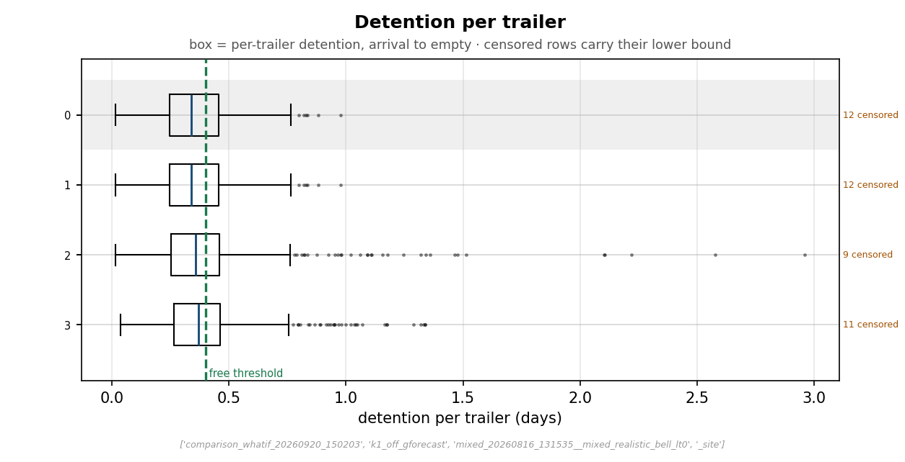
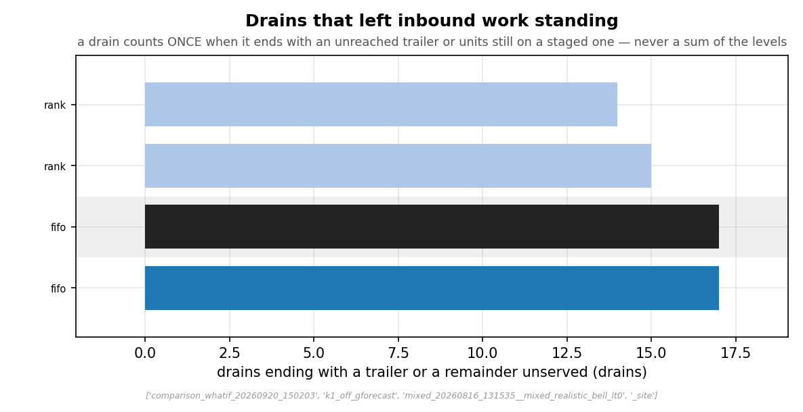
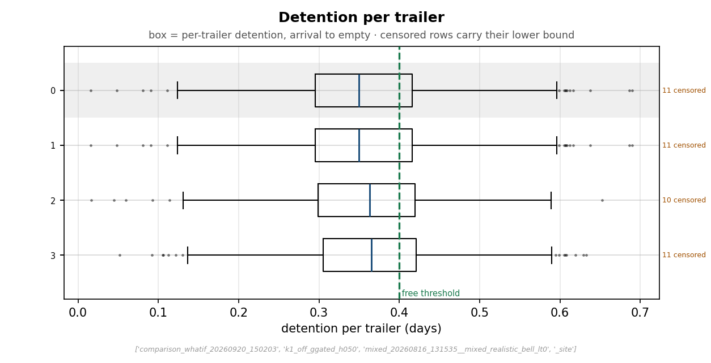
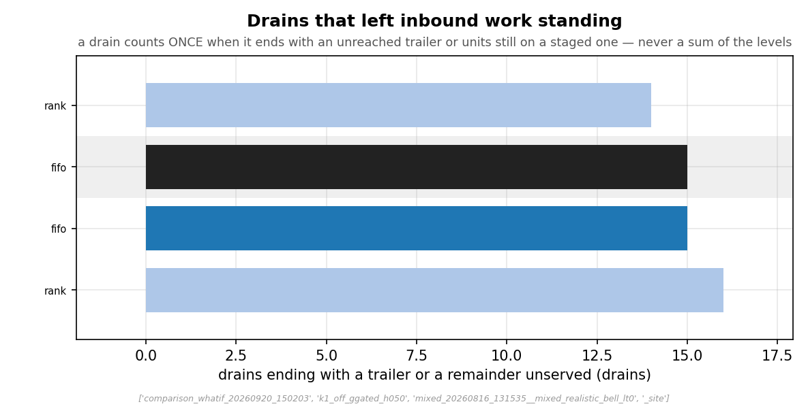

# The yard — what each policy left standing

*This is the evidence page for the yard half of the [Results](index.md) summary: what the site's
dock did under each rule, read from the site-scope figures the run renders once per cell.*

!!! note "Summary"
    Every unloading rule handles the same trailers; what differs is how long each one waits.
    First-come-first-served accrues **19 trailer-days** past the free threshold over the forty
    days on the winner pair; the rules that defer trailers to place their stock better accrue
    **28 to 97**. The score they bought with it is at most 0.12 % of pick work.
      
    Every number on this page is quoted from the committed
    [`data/unload_ranking.json`](data/unload_ranking.json); the figures are the site-scope yard
    family, rendered by `Optimization/run_analysis.py` from the site databases.

!!! warning "Trailer-days, not dollars"
    Overage is a physical count — days a trailer sat past the free threshold, summed over
    trailers — and is never converted to money or mixed into labour hours on this site. A
    carrier's detention rate turns it into a bill; the [results page](index.md#sizing-the-yard-bill-in-your-numbers)
    shows the arithmetic with the blank left honest.

## How the yard works here

Trailers are **dispatched** when a product's stock falls to its reorder point and **arrive**
about a working day later with a wide spread, so on most days several stand waiting. The dock
has **four doors**; when one frees, the cell's rule picks the next trailer. A receiving crew,
sized by the simulator from the declared demand and shared by both channels, empties it; the
units then go to put-away under the cell's placement pair. The **free threshold** is 0.40 days
from arrival; time past it is **overage**. A **drain** is one working day's dock activity; a
drain is **binding-cut** when the crew's day ends with trailers still staged, and **contended**
when it starts with trailers standing and no free door. When a drain is cut, nothing is worked
over: the receiving crew goes home at its whistle, the staged trailers keep their doors and are
finished first thing the next day, and every day they stand counts toward their detention —
which is how a rule that defers trailers turns a cut into a bill rather than into overtime.

## The reference cell

<figure markdown>
  .run }}/{{ experiment().inventories.bell_lt0.id }}/_site/absolute_yard_scorecard.png){ width=920 }
  <figcaption>The reference cell's yard read-outs, one row per placement pair. First-come-first-
  served does the same thing whatever rule puts the stock away, so the rows differ only in what
  the placement pair itself does to reorder timing. Rows are labelled by the placement pair's rule family -- <code>fifo</code> is the FIFO restock rider, <code>rank</code> the winner pair -- and each family has two rows, one per starting layout (<code>opt</code>, <code>uni</code>); the figures do not spell the layout, which the site's chart family owes a fix for.
  Source: <code>absolute_yard_scorecard.png</code> (cell <code>{{ experiment().run }}</code>).</figcaption>
</figure>

<figure markdown>
  .run }}/{{ experiment().inventories.bell_lt0.id }}/_site/absolute_yard_depth.png){ width=920 }
  <figcaption>Trailers standing at the start of each drain, over the forty days. Depth is what an
  ordering rule chooses among: a yard of one has no order to choose, and this yard stands
  several deep for most of the run — the regime in which an unloading rule <em>could</em> have
  mattered. Source: <code>absolute_yard_depth.png</code> (cell <code>{{ experiment().run }}</code>).</figcaption>
</figure>

<figure markdown>
  .run }}/{{ experiment().inventories.bell_lt0.id }}/_site/absolute_detention_distribution.png){ width=920 }
  <figcaption>The whole distribution of per-trailer detention under first-come-first-served. The
  tail is short: a trailer waits its turn and no longer.
  Source: <code>absolute_detention_distribution.png</code> (cell <code>{{ experiment().run }}</code>).</figcaption>
</figure>

## A deferring cell

<figure markdown>
  { width=920 }
  <figcaption>The same distribution under <code>gforecast</code>. The body is similar; the
  <strong>tail</strong> is longer, because a gain rule holds a few trailers back repeatedly
  rather than delaying every trailer a little. This is what an overage of 91 trailer-days against
  19 looks like trailer by trailer.
  Source: <code>absolute_detention_distribution.png</code> (cell <code>k1_off_gforecast</code>).</figcaption>
</figure>

<figure markdown>
  { width=920 }
  <figcaption>Drains cut short by the crew's day rather than by the yard emptying, per placement
  pair, under <code>gforecast</code>. A deferring rule does not change how many trailers the crew
  can empty in a day; it changes which ones are still standing when the whistle goes.
  Source: <code>absolute_binding_cuts.png</code> (cell <code>k1_off_gforecast</code>).</figcaption>
</figure>

## The gated rule the ask names

`ggated_h050` is the rule the [results page](index.md#the-ask) says to pilot if a site insists
on one, so its own trailer-by-trailer shape belongs here, not only its totals:

<figure markdown>
  { width=920 }
  <figcaption>Per-trailer detention under <code>ggated_h050</code>. The clock at half the free
  threshold caps how long any trailer can be deferred, so the tail is between the reference's
  and <code>gforecast</code>'s: a few trailers wait longer than under arrival order, none
  waits repeatedly. Source: <code>absolute_detention_distribution.png</code>
  (cell <code>k1_off_ggated_h050</code>).</figcaption>
</figure>

<figure markdown>
  { width=920 }
  <figcaption>Drains the crew's day cut short under <code>ggated_h050</code>, per placement
  pair. Read against the <code>gforecast</code> figure above: the gate does not change how
  many trailers a day the crew empties, so the cuts are of the same order, and what it changes
  is which trailers are standing at the whistle.
  Source: <code>absolute_binding_cuts.png</code> (cell <code>k1_off_ggated_h050</code>).</figcaption>
</figure>

## Overage across every cell

The cross-cell totals, on the winner pair, lowest first. In floor words: the ranking on the
results page could not separate most of the rules by how much walking they saved the pickers,
so it fell back to the next question — *which rule kept trailers waiting least* — and this
column is that question's answer:

| cell | overage, trailer-days | vs `fifo` |
|---|---:|---:|
| `k1_off_fifo` | 19.4 | reference |
| `k1_off_ggated_h100` | 19.4 | identical |
| `k1_off_gmyopic_k8` | 23.5 | +21 % |
| `k1_off_ggated_h050` | 27.8 | +43 % |
| `k1_off_ggated_h025` | 49.6 | +156 % |
| `k1_off_gmyopic` | 54.6 | +181 % |
| `k1_off_lifo` | 85.4 | +340 % |
| `k1_off_gforecast` | 91.4 | +371 % |
| `k1_off_fsight_wall` | 92.1 | +375 % |
| `k1_off_fsight_w5` | 96.6 | +398 % |

<small>`overage_days` per cell from the winner-pair ranking in
[`data/unload_ranking.json`](data/unload_ranking.json) (both starting layouts summed).
`k1_off_inb_off` runs no yard and has no row.</small>

**The yard never runs away under any rule.** Every cell's depth trace returns to its baseline
within the run, `lifo` included — its trailers wait longer and out of order, but the doors
are never permanently swamped, and every cell handled the same trailers by the end — 1,284
to 1,289 for the winner pair's two runs, the spread being a few reorders that fell either
side of the last day (the `trailers` count on each row of the ranking). A rule that destabilised the queue would be
disqualifying whatever it scored; none did. <small>The reference cell's trace is above; the
`lifo` cell's is staged at `images/k1_off_lifo/…/_site/absolute_yard_depth.png`, and the
per-cell trailer counts are in [`data/unload_ranking.json`](data/unload_ranking.json).</small>

Two shapes in that column. `ggated_h100` gates at the whole free threshold, so by the time it
would defer a trailer the trailer is already urgent, and it reproduces arrival order exactly.
`lifo`, the adversarial control, runs up a yard bill comparable to the foresight rules while
placing *worse* than `fifo` — the proof that a long yard is not the price of good placement, it
is just a long yard.

## Under the FIFO restock rider

The same cells under the rider — first-free-slot put-away in both channels — order differently,
and the difference is the control reading:

{{ unload_ranking(control=True) }}

`ggated_h100`, `gmyopic` and `gmyopic_k8` are byte-identical to the reference here: a gain rule
scoring trailers by how well their contents would be slotted has nothing to score when every
slot is chosen at random, so it degenerates to arrival order. `lifo` and the forecasting rules
still move the yard, because their rule does not depend on the slotting beneath it. The
[full-results page](full-results.md#the-rider-as-a-control) carries the verdict as the ranking
tool states it.

## What this page does not show

The per-drain **order** each rule chose — which trailer went first and why — is not a published
artifact; the yard databases hold it and the campaign record describes the mechanism. The
per-cell wall-clock **compute cost** of the gain rules is likewise on the campaign record
rather than this site: the gain rules price every standing trailer against every other on
every drain, and at this run's yard depth that made the deferring cells several times slower to
simulate than first-come-first-served. It is the reason the successor study starts with a
cheaper evaluator. That cost is the *simulator's*, not a site's: a real dock plans one drain a
day over a couple of dozen standing trailers, seconds of scoring on any server, so compute is
not what disqualifies these rules — the yard bill is.
