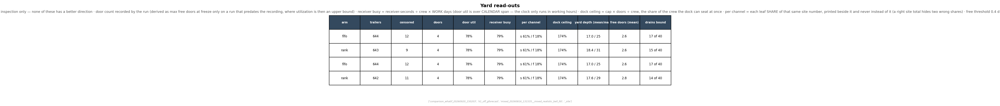
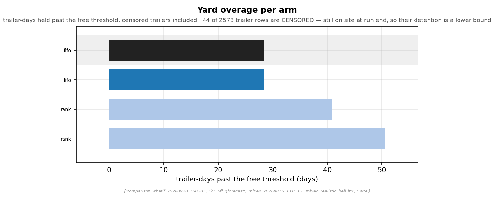

# {{ experiment().title }}

**One question, one site, eleven ways to answer it.** When several trailers are waiting in the
yard and a door comes free, **which one does the dock unload first?** That choice is a rule
inside dock software, not a construction project, and this experiment runs the same forty
simulated site days under eleven such rules over the full **400,000-SKU catalogue**, with the
best placement rules from [Experiment 8](../experiment-8/index.md) putting the stock away in
every one of them. Nothing else moves between the eleven runs: same orders, same trailers, same
crews, same warehouse.

Two things an unloading rule can change, and they are measured separately here:

- **Where the stock lands.** A trailer unloaded first meets a fuller choice of empty slots than
  one unloaded last, so the order can in principle change how much walking the pickers owe
  later. That is what the "smart" rules below try to buy.
- **How long trailers wait.** A rule that holds a trailer back to give another the better slots
  runs up **detention** — days a trailer sits past the free threshold, which a carrier bills.

!!! success "The finding"
    - **At this site's demand, the order trailers are unloaded in does not move the pick work.**
      Across the ten rules that run a yard, the placement score that the ranking is built on
      moves by at most **0.12 %** against first-come-first-served, and the total hands-on
      labour of the forty days by at most **±0.15 %** in either channel — of roughly
      **7,400 store hours and 6,600 fulfillment hours** over the forty days, about ten hours
      either way. The day's length barely moves either: the store clears its run in ~243
      elapsed hours in every cell, fulfillment in ~289. Those gaps are real (they clear a
      floor measured from the run's own batch-to-batch noise) and they are operationally
      nothing.
    - **What separates the rules is the yard bill.** The rules that place stock fractionally
      better do it by making trailers wait: their accrued overage runs from **28 to 97
      trailer-days** over the forty days against **19** for first-come-first-served. The
      ranking's tie-break, not its score, decides the order.
    - **This is a result, not a failed experiment.** The mechanism is arithmetic, stated in the
      box below, and it says when an unloading rule *could* matter: on a site whose windows
      re-ask for what inbound just placed. This one does not.

<small>Sources: the placement-score gaps, the measured floor and every cell's overage are in
[`data/unload_ranking.json`](data/unload_ranking.json); the labour bound is the labour block of
[`data/whatif_delta.json`](data/whatif_delta.json) — the **median** per-task labour change of
each cell against the reference, both channels, all within ±0.15 %, and that median is the
number to carry into a room. The [full-results page](full-results.md#the-labour-bound-per-cell)
also prints the census over every one of the eighty individual arm-versus-arm comparisons,
whose single widest reading is +0.244 %. That reading is `opt_rank_cartlabor` in the store
of `k1_off_inb_off` -- the no-yard pole this finding excludes by its own wording, since it
runs no dock rule at all; among the ten yard cells the widest single comparison is
+0.071 % (`uni_rank_cartlabor`, store, `k1_off_ggated_h025`), inside the bound. Per-arm rows
with their cell are the `labor_delta_vs_ref_pct` field of
[`data/whatif_volume.json`](data/whatif_volume.json). The hours and elapsed hours per cell are the
`labor_hours` / `elapsed_hours` rows of [`data/whatif_volume.json`](data/whatif_volume.json),
tabulated on the [full-results page](full-results.md#the-labour-bound-per-cell).</small>

!!! danger "Why no unloading rule could have won here, in one paragraph"
    The score prices every planned pick line from where its SKU's stock stands, and the
    planned demand is thin: the forty-day script asks for **24,725 store lines** and **119,223
    fulfillment lines** over a **400,000-SKU catalogue**, so most products are asked for once
    or never inside the window. An unloading rule can only change which empty slot an arriving
    pack takes, and that pack lands beside the four to eight slots the product already holds.
    One new slot among several, on a product asked for about once, moves the score by a sliver
    — and the sum of slivers is the 0.04–0.12 % on this page. The stock this run's dock put
    away is mostly picked in *later* windows than the one that scored it: of the units the
    dock put away inside the forty days, **9 % in the store and 24 % in fulfillment were picked
    again before the window ended**, and only **9 % of the store's picks and 23 % of
    fulfillment's** came from a slot the dock had filled. A site where replenishment turns
    over inside the window (short coverage, fast movers dominating the script) is where the
    same rules get room to differ; this catalogue is not that site.

    <small>Provenance: the line counts are the `planned_weight` the ranking records per unit,
    and the re-pick shares are its `inbound_repick` block (reference cell, winner pair, unit
    grain: a unit counts as picked again on any pick from the slot it was put into after the
    put-away), both in [`data/unload_ranking.json`](data/unload_ranking.json); the catalogue
    size is the declared count in [`data/inventory_model.json`](data/inventory_model.json).
    The slots a picked product already holds — **4.0 in the store, 7.6 in fulfillment** on
    average at setup — are the same block's `bins_per_picked_sku`.</small>

**What a dock rule changes on the floor, and what it does not.** A dock rule is a setting in the
software that tells the receiving crew which trailer to open next. It changes **nothing** about
how pickers get their next task or where they are sent: picking, the wave order, the crews and
the put-away rule are identical in every cell. It changes which trailer the receiving crew opens
first, and therefore how long the others wait. Put-away crews *are* modelled here — a put crew
walks each unit to the slot the placement rule chose and its hours are recorded — but two
crews converging on one aisle, blocked slots and damaged locations are not, for any cell alike.

**One site, two channels, one dock.** Unlike every earlier experiment, the two channels here are
*coupled*: one dock with **four doors**, one receiving crew and one yard serve both, so a store
trailer and a fulfillment trailer compete for the same door. Each channel still picks from its
own disjoint racking with its own crew. The [how-a-run-works page](comparison-overview.md) states
exactly what is shared. One scope line worth reading before the tables: the warehouse is
**stocked once at setup, not through the yard** — only replenishment passes the dock — so this
experiment says nothing about how a dock rule performs when filling an empty building. That is
the registered successor study, named in the ask below.

## The eleven rules, in plain terms

| cell | the dock's rule | what it needs to run |
|---|---|---|
| `fifo` | **first come, first served** — the reference, and what a yard does by itself | nothing |
| `lifo` | newest trailer first — a deliberately bad rule, there to bound the other direction | nothing |
| `gmyopic` | unload the trailer whose contents would land *best today*, judged against the empty slots the warehouse has right now | the slotting rule's own scoring, run on the yard |
| `gforecast` | the same, also counting the slots today's picks are about to free | the same, plus the day's released orders |
| `ggated_h025` / `h050` / `h100` | `gforecast`, but any trailer waiting longer than a quarter / half / all of the free threshold goes first, in arrival order | the same, plus a clock |
| `fsight_w5` / `fsight_wall` | `gforecast` allowed to read the *next* five days' orders / the whole run's — an oracle, not a policy, run to bound what foresight could buy | the future |
| `gmyopic_k8` | `gmyopic` restricted to the eight longest-waiting trailers | the same, cheaper to compute |
| `inb_off` | no yard at all: units appear on the shelf when their lead time ends, the pre-dock model every earlier experiment used | — |

<small>Rules from the run's own spec (`inbound_unload`). The free threshold is **0.40 days** in
every cell -- the phase-2 axis sets it per cell, and the ranking records the value each
cell's overage was folded against in [`data/unload_ranking.json`](data/unload_ranking.json)
(`metric.tie_break.threshold_days`); the 2.0 days in [`data/held_fixed.json`](data/held_fixed.json)
is the run-level default the cells override. The door count **4** is in
[`data/held_fixed.json`](data/held_fixed.json). "Gain" rules score a trailer by re-running the
site's placement rule virtually on its contents; the [formula reference](formula-reference.md)
carries the arithmetic.</small>

## The quick read

The ranking, on the placement pair every cell shares (`rank_cartlabor` in store,
`rank_minlabor` in fulfillment — Experiment 8's winners). In floor words before the columns:
the **score** is how much walking the pickers would owe if they served the run's orders from
where the stock stands — lower is less walking; cells whose scores sit within a small band of
each other are treated as **tied**, and ties are broken by how long trailers waited in the
yard (**overage**, lower first). One placement pair ranks these cells; the FIFO pair every cell
also runs is read as a control rather than a second vote, so the order below is **not
replicated** by an independent placement rule — the [full-results page](full-results.md#the-rider-as-a-control)
says what the control does show.

{{ unload_ranking() }}

How to read it: the **score** is seconds of pick work the forty days' planned orders would owe
if served from where the stock stands, meaned over the run and summed over the pair's two runs
(both starting layouts). **vs reference** is the paired gap to `fifo` with its interval. Cells
closer than the **floor** (0.080 %, measured) are a **tie group**, and inside a group the
**overage** — trailer-days past the free threshold — orders them. Every rule that reads as
"cheaper" than first-come-first-served sits in one tie group with the others like it, and its
rank inside that group is its yard bill, lowest first.

So the top three named for the next phase — `ggated_h050`, `ggated_h025`, `gforecast` — are
the three cheapest *yards* among the five rules that place fractionally better. That is the
honest statement of what this ranking knows.

!!! warning "What kind of evidence this is"
    A **controlled A/B experiment inside a simulation**: the identical forty site days replayed
    under eleven dock rules. In floor terms: the run is **40 consecutive working days**, each
    releasing one wave of orders per channel; the **store crew is 31 pickers** and the
    **fulfillment crew 23**, sized by the simulator from the declared demand rather than
    chosen; a **receiving crew of 23** works the four doors and a **put-away crew of 64**
    carries what they unload, both derived the same way and shared by the two channels;
    trailers are dispatched when a
    product's stock falls to its reorder point and arrive about a working day later with a wide
    spread, so the yard stands several trailers deep most days. The demand is an ordinary
    steady period, not a peak. It is **one draw, not many** — every cell replays the same
    sequence, which is what makes the tiny gaps exact rather than noisy, and it is why the
    floor is measured from the paired batch-to-batch series instead of assumed.
      
    **What the model leaves out, and which way it leans.** Breaks, lunches and shift changes
    inside a working day are not modelled; neither is walking between aisles, two crews
    meeting in one aisle, or a blocked slot. Every cell carries the same omission, so none of
    them tilts one dock rule against another — the labour bound and the overage ranking are
    *within-run* comparisons, and a break that a real receiving crew takes lengthens every
    cell's yard by the same amount. What the omissions do bias is the **absolute** level: a
    crew that never pauses empties more trailers per day than a real one, so the trailer-days
    on this page are a floor on a real site's, not a ceiling. Read the differences between
    cells; do not read the levels as a forecast.
      
    **The dock was staffed to its demand, and that is a boundary of the finding.** Every crew
    here is derived from the declared demand, so the receiving crew is the size the work
    calls for and the yard stands deep because trailers arrive faster than four doors turn
    them, not because hands are short. A chronically short-handed dock — open reqs,
    call-outs, hiring lag — is a different regime, one where a scarce door-hour is worth more
    and an unloading rule might have more to decide; **it was not tested here**, and this
    page's "keep first-come-first-served" holds only for a dock staffed to its demand. The
    cheap test for which regime yours is in: a dock that regularly ends its day with trailers
    still at the doors, or runs overtime to clear the yard, is short of its demand; one whose
    yard clears by the whistle on an ordinary day is the regime tested here.
    <small>Picker crews from each channel's committed `config.json` under `images/`; the
    receiving and put-away crews from `run.site_crews` in
    [`data/unload_ranking.json`](data/unload_ranking.json); day count, coupling and the absent
    factors from [`data/held_fixed.json`](data/held_fixed.json).</small>

!!! note "A new era, and not comparable with Experiment 8"
    Three things changed at once since [Experiment 8](../experiment-8/index.md): the two
    channels are **coupled** through one dock; the run carries a **standing yard** with derived
    crews and per-item handling charges; and the batch sampler is the declared **v3** stream.
    Numbers here are compared **within this experiment**. Experiment 8 remains the reference
    for the placement and scheduling levers, which this run held fixed.

## What the smart rules actually did

<figure markdown>
  { width=920 }
  <figcaption><strong>Figure 1.</strong> The yard's read-outs for the <code>gforecast</code>
  cell, one row per placement pair the cell ran: trailers handled, doors, door utilisation,
  receiver busy share (<code>s</code> / <code>f</code> in the per-channel column are store /
  fulfillment). A read-out, not a ranking — it says what regime the dock ran in. Rows are labelled by the placement pair's rule family -- <code>fifo</code> is the FIFO restock rider, <code>rank</code> the winner pair -- and each family has two rows, one per starting layout (<code>opt</code>, <code>uni</code>); the figures do not spell the layout, which the site's chart family owes a fix for. The same
  figure for the reference cell is on the <a href="../comparison/">yard page</a>.
  Source: <code>absolute_yard_scorecard.png</code> (cell <code>k1_off_gforecast</code>).</figcaption>
</figure>

<figure markdown>
  { width=920 }
  <figcaption><strong>Figure 2.</strong> Trailer-days past the free threshold in the
  <code>gforecast</code> cell, per placement pair. The pair that places by load balance
  (<code>rank_cartlabor</code> / <code>rank_minlabor</code>) gives the gain rule something to
  optimise for, and the rule defers trailers to get it; under the FIFO restock rider the same
  rule has nothing to optimise and behaves like arrival order. Cross-cell totals are in the
  ranking table above.
  Source: <code>absolute_yard_overage_days.png</code> (cell <code>k1_off_gforecast</code>).</figcaption>
</figure>

Three readings that hold across the ten yard cells:

- **A gain rule is only as active as the slotting rule beneath it.** Under the FIFO restock
  rider, `gmyopic`, `ggated_h100` and `gmyopic_k8` are **byte-identical** to first-come-first-
  served: when put-away is first-free-slot there is no better slot to defer for, so the rule
  falls back to arrival order. The ranking tool reads the rider as a control for exactly this
  reason. <small>[`data/unload_ranking.json`](data/unload_ranking.json), `rider_control`.</small>
- **Foresight does not help, and that is the strongest bound on the page.** The two `fsight`
  cells are allowed to read orders that have not been placed yet. They land in the same tie
  group as the lawful rules, 0.10–0.12 % cheaper than `fifo` on the score and among the
  costliest yards. If knowing the future buys a tenth of a percent, no forecast will buy more.
- **The gate is the sane middle.** `ggated_h050` holds trailers only until half the free
  threshold, keeps 0.04 % of score and the smallest yard bill of the deferring rules. If a
  site insisted on piloting one of these, that is the shape to pilot: a gain rule with a clock
  on it.

## The ask

This experiment does **not** ask for a dock-policy pilot, and that is its contribution: eleven
rules, one of them an oracle, could not separate themselves on the work by more than a tenth
of a percent on a full-scale site, so a WMS project to install one would be buying detention
days. What it asks for instead:

1. **Keep first-come-first-served at the dock** unless your site is the kind the box above
   describes — replenishment that turns over inside the pick window. The test is cheap and
   yours to run: take a month of receipts and ask, **unit by unit, what share of the units put
   away were picked from the slot they went into before the month ended** (any pick after the
   put-away counts; count units, not products). On this site that share was **9 % in the
   store and 24 % in fulfillment** over forty days, and eleven rules could not separate
   themselves. Below roughly a quarter an unloading rule has nothing to work with; a site at
   half or more is the one where this experiment's question is still open.
   *How to pull that from a WMS, honestly:* the unit-level version needs put-away events
   joined to pick events by slot, which most systems do not report out of the box — treat it
   as a one-off data request to IT, not a dashboard query. If that is not on offer, two
   coarser proxies bracket it: at product level, the share of the products received in the
   month that were picked at all in that month (an upper bound on the unit share); or the
   month's picked units divided by units on hand at its start (the stock turn inside the
   window — this run's was about a twelfth in the store and half in fulfillment). Either
   proxy reading well under a quarter says the same thing the unit-level number would.
   <small>The shares are the `inbound_repick` block of
   [`data/unload_ranking.json`](data/unload_ranking.json), reference cell, winner pair; the
   stock-turn proxy is that block's `picked_units` against the setup stock the
   [lifecycle page](comparison-overview.md#the-inventory-model) tabulates.</small>
2. **If a site does pilot a gain rule, gate it with a clock**, as `ggated_h050` does, and make
   **detention days the primary measurement**, beside pick hours — the model's whole finding is
   that the former moves and the latter does not. *What "gate it with a clock" means at the
   dock:* the software may hold a trailer for a better slotting outcome only until it has
   waited a set time — here, half the free period; any trailer past that goes to the next open
   door in arrival order regardless of its score. For the receiving crew that is the whole
   change: the next trailer to open is the one the screen names, and a trailer that has waited
   past the clock is always at the top. *What it is in the software:* the clock half is a
   priority-by-age rule most yard- and dock-management systems expose as configuration; the
   gain half — scoring a trailer by where its contents would be slotted — is a custom hook
   into the put-away scorer, a vendor change request rather than a setting, which is a second
   reason not to start there. *Success criteria:* pick hours flat within the noise of
   comparable weeks AND detention days not above the baseline weeks; *rollback:* any week where
   accrued detention exceeds the baseline's, revert to arrival order that shift. And ask the
   receiving lead in week one which trailers actually waited and why — the model has no
   damaged-slot, blocked-door or mixed-load exceptions, and the floor's own list of those is
   the pilot's first amendment. (The pick crew is not consulted here only because this rule
   does not touch its work; a pilot that ever does should ask the pick lead the same way.)
3. **The next experiment asks the placement question where it can be answered.** A *fill
   trial* — an empty warehouse receiving its whole stock through the yard, then picked — gives
   every unloading rule every slot to choose among. It is registered as the successor study;
   its result, not this page, will say which rule places stock best when everything must land.

## Sizing the yard bill in your numbers

The model reports **trailer-days**, never dollars. Turning them into a line takes one number
only your carrier contract has: *trailer-days past the free period × your detention rate per
day*. Over forty days the cells ran **19 to 97** such days on the winner pair; scale by your
site's trailer count against this run's — **about 640 trailers per site run over the forty
days, sixteen a day**, the same within a handful in every cell (the `trailers` field on each
ranking row, ~1,290 for the winner pair's two runs together). **Do not scale by your free
period.** Overage is a censored sum — each trailer contributes only the part of its wait
past the threshold — so a longer free period than this run's 0.40 days drops trailers out
of the sum rather than shrinking every term, and how many drop out depends on the shape of
the wait distribution, not on the ratio of thresholds. The per-trailer detention
distributions on the [yard page](comparison.md) are what to re-cut at your own free period;
a dollar figure at a free period of a day or more needs that re-cut, not a proportion. *Worked, with a placeholder rate that is yours to
replace:* at **\$150 per trailer-day**, first-come-first-served's 19 days cost about **\$2,900**
over the forty days, and the costliest deferring rule's 97 days about **\$14,500** — a gap of
roughly **\$11,600 per forty days**. The forty days are **working** days, so on a
250-working-day year that is about **\$72,000 a year** (use 365 only if your yard bills on
calendar days over weekends too), bought for a tenth of a percent of pick hours, which on the
labour bound above is about ten hours — at a \$30 loaded rate, about **\$300 per forty
days**, against the \$11,600. A rule that defers
to place better is paying that line to save those hours; the arithmetic decides, and on any
ordinary detention rate it decides against.

## Go deeper

1. **[The yard — what each policy left standing](comparison.md)** — the site yard's figures for
   the reference cell and the deferring cells, depth over the run, detention, binding cuts.
2. **[Every cell, every arm](full-results.md)** — both rankings (winner pair and rider), the
   control verdict, the labour bound per cell, and every per-arm figure.
3. **[How a run works](comparison-overview.md)** — the coupled site: one dock, the yard, derived
   crews, what is shared and what is not.
4. **[Formula reference](formula-reference.md)** — the placement score, its census adjustment,
   the measured floor, and how a gain rule prices a trailer.
5. **[Inventory distributions](inventory.md)** — the catalogue.
6. **[Glossary](glossary.md)** — every term on these pages, each with a stable anchor.
