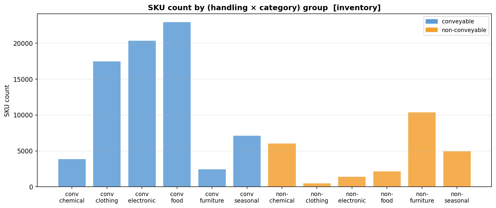
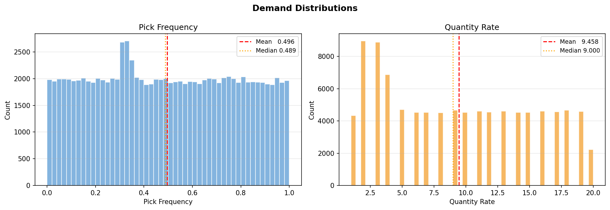
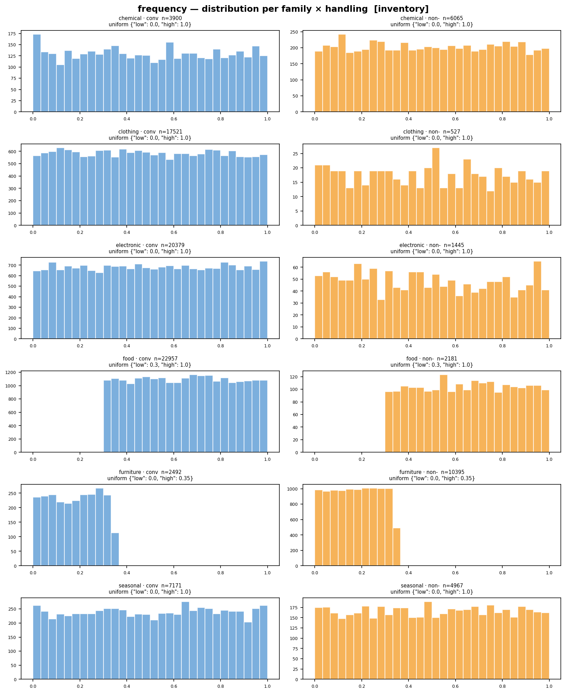
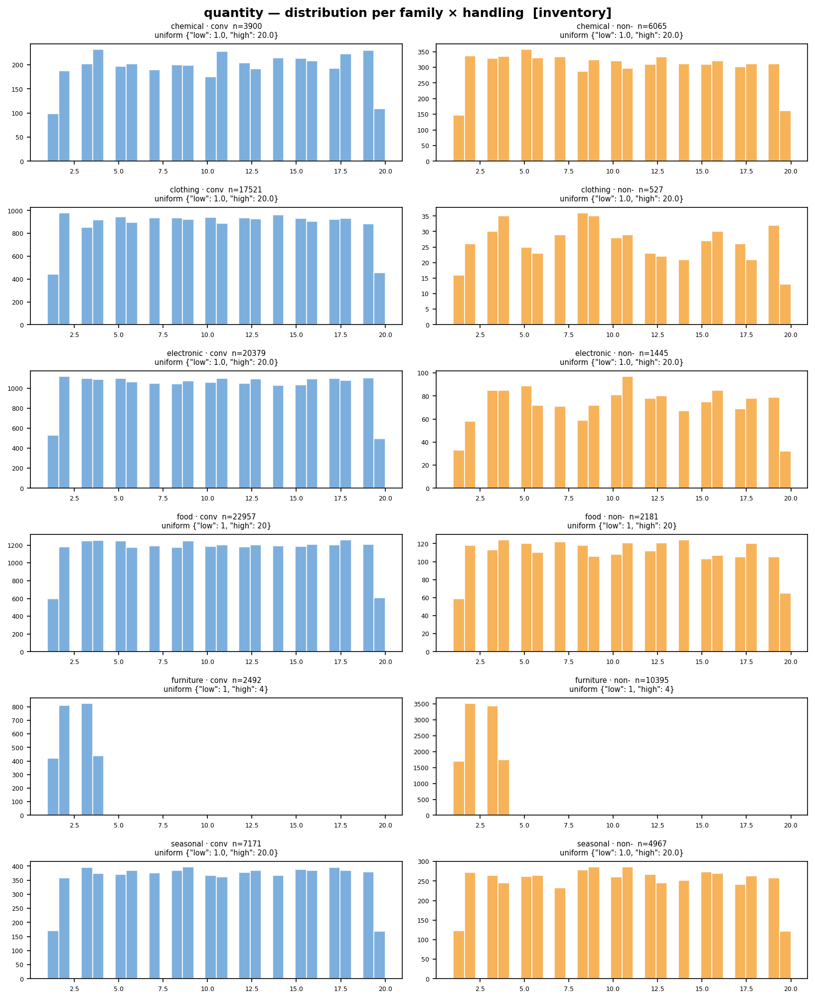
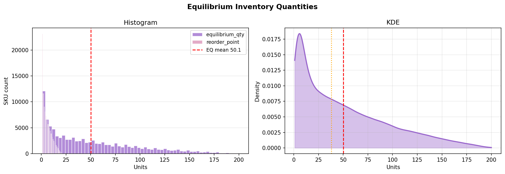

# Inventory distributions

Every simulation run is populated from a synthetic SKU catalogue. The runs written up
here all use the **`mixed_realistic`** catalogue: 100,000 SKUs drawn from six product
categories, each with its own size, weight, handling, and demand distributions. The
tables below are generated directly from the committed `params.json` snapshots, so they
always match what the simulation actually used.

!!! note "The two variants differ only in replenishment lead time"
    `mixed_realistic_lt0` uses **{{ inv_lead_time('mixed_realistic_lt0') }}** replenishment,
    while `mixed_realistic_ltrand0-5` uses **{{ inv_lead_time('mixed_realistic_ltrand0-5') }}**.
    Everything else — seed 42, 100,000 SKUs, the six-category creation plan below,
    supply coefficient-of-variation (CV) ceiling, and the 10-batch equilibrium coverage — is **identical** between
    them. Any performance difference between the variants is therefore attributable to
    lead-time variability alone.

## Category creation plan

Shares, dimension distributions (inches), weight model, conveyable/non-conveyable
handling split, and per-SKU order **freq**uency and **qty** ranges:

{{ inv_distribution_table('mixed_realistic_lt0') }}

**Reading the specs:** `tri(a–b, mode m)` is a triangular distribution; `norm(μ, σ)` a
normal; `U(a–b)` a uniform draw; `mix(p·… + q·…)` a probabilistic mixture of components.
Weights are Poisson-distributed and scaled by item volume (`∝ volume`), optionally with a
category multiplier, except chemicals which use a fixed rate.

## Category shares &amp; demand

These are the catalogue's own generation plots (the analysis output of
[`generate_inventory.py`](https://github.com/EdgyPage/Inventory_Location_Optimizer/blob/main/Warehouse/generation/generate_inventory.py)),
for the seed-42 catalogue both variants share.

<figure markdown>
  { width=820 }
  <figcaption>Distribution of categories — SKU count per (handling × category) group. Food,
  electronic, and clothing dominate; furniture skews non-conveyable.</figcaption>
</figure>

<figure markdown>
  { width=820 }
  <figcaption>Catalogue-wide demand: relative pick-frequency (a [0,1] selection share,
  ≈U(0,1), mean 0.50) and quantity rate (mean ~9.5 units/pick).</figcaption>
</figure>

<figure markdown>
  { width=820 }
  <figcaption>Demand across categories — relative pick-frequency (a [0,1] share) distribution
  per (category × handling). Note food's <code>U(0.3–1.0)</code> floor and furniture's
  <code>U(0–0.35)</code> cap.</figcaption>
</figure>

<figure markdown>
  { width=820 }
  <figcaption>Quantity-rate distribution per (category × handling); furniture is capped at
  <code>U(1–4)</code>, most others span <code>U(1–20)</code>.</figcaption>
</figure>

<figure markdown>
  { width=820 }
  <figcaption>Derived stock targets: equilibrium quantity (mean 50.1) and reorder point,
  from each SKU's expected demand via the model below.</figcaption>
</figure>

## How the catalogue is generated

The catalogue and its steady-state stock levels are produced by
[`Warehouse/generation/generate_inventory.py`](https://github.com/EdgyPage/Inventory_Location_Optimizer/blob/main/Warehouse/generation/generate_inventory.py).
Each SKU is assigned an equilibrium quantity and a reorder point from its expected demand:

!!! abstract "Equilibrium / reorder model"
    {{ reorder_formula('comparison_20260627_054619', 'mixed_20260624_083549__mixed_realistic_ltrand0-5', 'calibrated') }}

    The warehouse is sized so every SKU can hold its equilibrium quantity; the reorder
    point triggers replenishment `lead + safety` batches ahead of stock-out. In the
    `lt0` variant orders arrive immediately; in `ltrand0-5` they arrive after a uniform
    0–5 batch delay, so stock can dip below the reorder point before it is refilled.

See the [results write-ups](../results/index.md) for how each strategy performs on these
catalogues.
